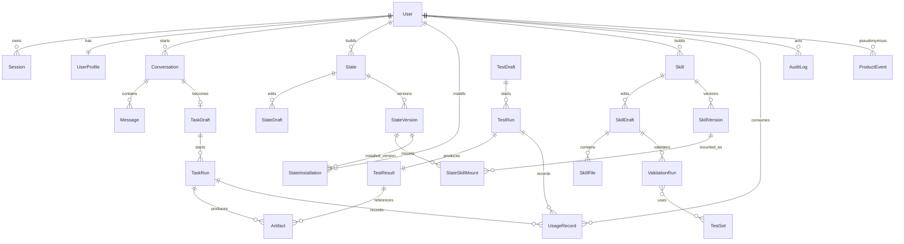

# 应用界面数据字典

- Figma 文件：[应用界面 Copy](https://www.figma.com/design/lWtoH8PCoOoPP3ttwMUBP6/应用界面--Copy-)
- 编写日期：2026-07-14
- 当前版本：`Draft v0.1`
- 依据：[03-user-flows.md](./03-user-flows.md)、[04-interaction-matrix.csv](./04-interaction-matrix.csv)
- 用途：统一前端、后端、数据库和测试人员使用的数据对象与字段名称

## 1. 这份文件解决什么问题

这份数据字典不是数据库建表 SQL，也不是最终 API 文档。它先统一产品里的业务语言：

1. `State`、`StateVersion` 和 `StateDraft` 分别代表什么。
2. 前端提交的字段叫什么、是什么类型、是否必填。
3. 后端返回的数据状态有哪些。
4. 哪些字段包含隐私、密钥或内部运行信息。
5. 不同对象通过哪个 ID 建立关系。

后续 API 文档、数据库设计、前端 TypeScript 类型和测试用例都应复用本文件的名称。未经评审，不应在不同模块里为同一含义创造另一套字段名。

## 2. 通用命名与类型规范

### 2.1 命名规则

| 规则 | 正确示例 | 不建议示例 |
|---|---|---|
| API 字段统一使用 `snake_case` | `state_version_id` | `stateVersionId`、`state-version-id` |
| 主键统一以 `_id` 结尾 | `task_run_id` | `task_run_key` |
| 时间统一以 `_at` 结尾 | `created_at` | `create_time` |
| 布尔值使用 `is_`、`has_`、`can_` | `is_active` | `active_flag` |
| 数量使用 `_count` | `skill_count` | `skills_num` |
| 状态字段使用小写 `snake_case` 枚举 | `in_progress` | `In Progress` |
| 版本并发控制使用 `_revision` | `draft_revision` | `last_number` |

### 2.2 基础类型

| 类型 | 含义 | JSON 示例 |
|---|---|---|
| `ID` | 不透明唯一标识，建议 UUID/ULID；前端不得解析含义 | `"01J2..."` |
| `string` | 普通文本 | `"Strategy Operator"` |
| `text` | 可能较长的文本 | `"Create a board brief..."` |
| `integer` | 整数 | `42` |
| `decimal` | 小数或评分 | `96.5` |
| `boolean` | 布尔值 | `true` |
| `timestamp` | ISO 8601 UTC 时间 | `"2026-07-14T10:21:32Z"` |
| `enum` | 本文件限定值之一 | `"running"` |
| `object` | 结构化 JSON 对象 | `{ "mode": "deep" }` |
| `ID[]` | ID 数组 | `["id_1", "id_2"]` |
| `string[]` | 文本数组 | `["research", "strategy"]` |

### 2.3 通用字段

除特别说明外，可持久化对象统一包含：

| 字段 | 类型 | 必填 | 说明 |
|---|---|---:|---|
| `created_at` | timestamp | 是 | 创建时间，由后端写入 |
| `updated_at` | timestamp | 是 | 最近更新时间，由后端写入 |
| `created_by` | ID | 视对象 | 创建者 User ID |
| `updated_by` | ID | 视对象 | 最近修改者 User ID |
| `revision` | integer | 建议 | 乐观锁版本，每次写入递增 |
| `deleted_at` | timestamp/null | 否 | 软删除时间；有审计要求的对象不得物理删除 |

### 2.4 数据敏感级别

| 级别 | 含义 | 示例 |
|---|---|---|
| `公开` | 可在公开 Passport 或 Market 展示 | State 名称、公开描述 |
| `内部` | 登录用户可按权限查看 | Task 状态、普通配置 |
| `敏感` | 仅资源拥有者或授权成员查看 | 对话内容、上传资料、运行日志 |
| `高敏` | 不得返回明文，必须加密或脱敏 | 密码、访问令牌、第三方密钥 |

## 3. 对象总览

| 分组 | 对象 | 用途 | 主要流程 |
|---|---|---|---|
| 身份 | `User` | 账号主体 | FLOW-01 |
| 身份 | `UserProfile` | 姓名、头像和偏好 | FLOW-01 |
| 身份 | `Session` | 登录会话 | FLOW-01、GLOBAL |
| 身份 | `Notification` | 通知与未读状态 | GLOBAL |
| 内容 | `UploadSession` | 一次客户端到私有存储的上传会话 | FLOW-01、04、07、08 |
| 内容 | `Source` | 文件、文字、链接或数据连接 | FLOW-04、06、07、08 |
| 对话 | `Conversation` | 一次连续对话 | FLOW-03 |
| 对话 | `Message` | 用户或 State 的单条消息 | FLOW-03 |
| 分享 | `ShareLink` | 可撤销的分享链接 | FLOW-03、07 |
| 分享 | `ExportJob` | 多格式导出任务 | FLOW-03、07、08 |
| State | `State` | 稳定身份和所有权 | FLOW-02、05、06、09、10 |
| State | `StateDraft` | 未发布的可编辑配置 | FLOW-05、06 |
| State | `StateVersion` | 不可变的版本快照 | FLOW-02、06、10 |
| State | `StateSkillMount` | StateVersion 与 SkillVersion 的挂载关系 | FLOW-05、06 |
| State | `StateInstallation` | 用户安装 State 的记录 | FLOW-09 |
| State | `StateLearning` | State 保留的学习项 | FLOW-02 |
| State | `StateHealthSnapshot` | 某一时间点的健康和用量快照 | FLOW-02、10 |
| State | `MonitorEvent` | Monitor 实时事件 | FLOW-02、10 |
| State | `LedgerEvent` | 版本、分支、恢复等演化记录 | FLOW-10 |
| Skill | `Skill` | Skill 稳定身份 | FLOW-07 |
| Skill | `SkillDraft` | 可编辑的 Skill 草稿 | FLOW-07 |
| Skill | `SkillVersion` | 已验证或已发布的不可变版本 | FLOW-07 |
| Skill | `SkillFile` | Developer Mode 文件 | FLOW-07 |
| Skill | `SkillCapability` | Skill 能力声明 | FLOW-07 |
| Skill | `ImportJob` | 仓库或文件导入任务 | FLOW-06、07 |
| Skill | `ValidationRun` | Skill 验证运行 | FLOW-07 |
| Skill | `TestSet` | 验证所用测试集 | FLOW-07 |
| Skill | `ReviewItem` | 系统验证发现的问题 | FLOW-07 |
| Task | `TaskDraft` | 启动任务前的可编辑输入 | FLOW-04 |
| Task | `ContextTag` | Task/State/Test 的上下文标签 | FLOW-04 |
| Task | `TaskRun` | 一次不可重复的任务执行 | FLOW-04 |
| 运行 | `RunEvent` | TaskRun/TestRun 的增量事件 | FLOW-03、04、05、08、10 |
| 结果 | `Artifact` | 任务或测试产生的文件/结果 | FLOW-04、08 |
| Test | `TestDraft` | 启动测试前的输入配置 | FLOW-08 |
| Test | `TestRun` | 一次 State 测试运行 | FLOW-05、06、08 |
| Test | `TestResult` | 测试评分和结论 | FLOW-08 |
| Test | `SandboxSession` | 临时试用 State 的隔离会话 | FLOW-09 |
| 治理 | `AuditLog` | 高风险操作审计 | 全局 |
| 治理 | `UsageRecord` | Token、API、计算、存储和成本账本 | FLOW-02、03、04、05、07、08、10 |
| 分析 | `ProductEvent` | 去标识化产品行为事件 | 全局 |

## 4. 身份与账号

### 4.1 User

| 字段 | 类型 | 必填 | 敏感级别 | 说明 |
|---|---|---:|---|---|
| `user_id` | ID | 是 | 内部 | 用户唯一标识 |
| `email` | string | 是 | 敏感 | 登录邮箱，存储前标准化为小写 |
| `email_verified` | boolean | 是 | 内部 | 邮箱是否已验证 |
| `account_status` | enum | 是 | 内部 | `pending`、`active`、`suspended`、`deleted` |
| `onboarding_status` | enum | 是 | 内部 | `not_started`、`in_progress`、`completed` |
| `last_login_at` | timestamp/null | 否 | 内部 | 最近成功登录时间 |
| `created_at` | timestamp | 是 | 内部 | 账号创建时间 |
| `updated_at` | timestamp | 是 | 内部 | 最近更新时间 |

密码必须使用专用密码哈希保存，不在任何 API 响应、日志或审计详情中返回 `password`、`password_hash`。

### 4.2 UserProfile

| 字段 | 类型 | 必填 | 敏感级别 | 说明 |
|---|---|---:|---|---|
| `user_id` | ID | 是 | 内部 | 对应 User |
| `display_name` | string | 是 | 内部 | 页面显示名称 |
| `avatar_asset_id` | ID/null | 否 | 内部 | 对应头像文件 |
| `role_label` | string/null | 否 | 内部 | 例如 Founder |
| `locale` | string | 是 | 内部 | 例如 `zh-CN` |
| `timezone` | string | 是 | 内部 | IANA 时区，例如 `Asia/Shanghai` |
| `preferences` | object | 是 | 内部 | UI、通知和默认行为偏好 |
| `revision` | integer | 是 | 内部 | 防止多个页面互相覆盖资料 |

### 4.3 Session

| 字段 | 类型 | 必填 | 敏感级别 | 说明 |
|---|---|---:|---|---|
| `session_id` | ID | 是 | 敏感 | 登录会话 ID |
| `user_id` | ID | 是 | 内部 | 所属用户 |
| `access_token` | string | 是 | 高敏 | 只在认证交换时返回；不得落普通日志 |
| `refresh_token` | string/null | 视方案 | 高敏 | 应轮换并加密保存 |
| `device_info` | object | 否 | 敏感 | 设备、浏览器和客户端版本 |
| `ip_address` | string/null | 否 | 敏感 | 安全审计使用 |
| `expires_at` | timestamp | 是 | 内部 | Session 到期时间 |
| `revoked_at` | timestamp/null | 否 | 内部 | 主动退出或安全注销时间 |
| `created_at` | timestamp | 是 | 内部 | 创建时间 |

### 4.4 Notification

| 字段 | 类型 | 必填 | 敏感级别 | 说明 |
|---|---|---:|---|---|
| `notification_id` | ID | 是 | 内部 | 通知唯一标识 |
| `user_id` | ID | 是 | 内部 | 接收用户 |
| `type` | enum | 是 | 内部 | `task_completed`、`test_completed`、`publish_completed`、`system` 等 |
| `title` | string | 是 | 内部 | 通知标题 |
| `body` | text | 是 | 内部 | 通知正文 |
| `resource_type` | enum/null | 否 | 内部 | 目标资源类型 |
| `resource_id` | ID/null | 否 | 内部 | 点击后打开的资源 |
| `read_at` | timestamp/null | 否 | 内部 | 未读时为 null |
| `created_at` | timestamp | 是 | 内部 | 创建时间 |

## 5. 通用内容、分享与导出

### 5.1 UploadSession

`UploadSession` 只描述传输和安全接收过程；进入 `accepted` 后才能创建可用 Asset 或 Source。

| 字段 | 类型 | 必填 | 敏感级别 | 说明 |
|---|---|---:|---|---|
| `upload_id` | ID | 是 | 敏感 | 上传会话 ID |
| `user_id` | ID | 是 | 内部 | 发起用户 |
| `purpose` | enum | 是 | 内部 | `avatar`、`task_source`、`test_source`、`skill_source`、`skill_import`、`audio` |
| `owner_type` | string/null | 否 | 内部 | 目标父资源类型 |
| `owner_id` | ID/null | 否 | 内部 | 目标父资源 ID |
| `original_filename` | string | 是 | 敏感 | 规范化显示文件名 |
| `declared_mime_type` | string | 是 | 内部 | 客户端声明，仅供初筛 |
| `detected_mime_type` | string/null | 否 | 内部 | 后端检测 MIME |
| `declared_size_bytes` | integer | 是 | 内部 | 客户端声明大小 |
| `verified_size_bytes` | integer/null | 否 | 内部 | 后端确认大小 |
| `checksum_sha256` | string/null | 否 | 内部 | 内容校验值 |
| `status` | enum | 是 | 内部 | `created`、`uploading`、`uploaded`、`verifying`、`scanning`、`accepted`、`rejected`、`expired`、`aborted` |
| `storage_key` | string | 是 | 高敏 | 私有对象键，不返回普通前端 |
| `multipart` | boolean | 是 | 内部 | 是否分片上传 |
| `expires_at` | timestamp | 是 | 内部 | 上传会话过期时间 |
| `created_at` | timestamp | 是 | 内部 | 创建时间 |
| `completed_at` | timestamp/null | 否 | 内部 | 完成验证时间 |

### 5.2 Source

`Source` 统一描述 Task、Test、Skill 或 Conversation 使用的资料。数据库可拆分表，但 API 字段名称应保持一致。

| 字段 | 类型 | 必填 | 敏感级别 | 说明 |
|---|---|---:|---|---|
| `source_id` | ID | 是 | 敏感 | 资料唯一标识 |
| `owner_type` | enum | 是 | 内部 | `task_draft`、`test_draft`、`skill_draft`、`conversation` |
| `owner_id` | ID | 是 | 内部 | 所属对象 ID |
| `upload_id` | ID/null | 否 | 敏感 | 文件型 Source 的 UploadSession |
| `source_type` | enum | 是 | 内部 | `file`、`text`、`url`、`repository`、`data_connector` |
| `title` | string | 是 | 内部 | 用户可见标题 |
| `original_filename` | string/null | 否 | 敏感 | 文件型 Source 原始显示名 |
| `uri` | string/null | 否 | 敏感 | URL/仓库等外部来源；文件型 Source 不用它暴露私有存储地址 |
| `mime_type` | string/null | 否 | 内部 | 文件 MIME 类型 |
| `detected_mime_type` | string/null | 否 | 内部 | 后端检测 MIME |
| `size_bytes` | integer/null | 否 | 内部 | 文件大小 |
| `checksum_sha256` | string/null | 否 | 内部 | 文件完整性校验值 |
| `scan_status` | enum | 是 | 内部 | `not_required`、`pending`、`scanning`、`clean`、`blocked`、`failed` |
| `processing_status` | enum | 是 | 内部 | `pending`、`scanning`、`parsing`、`ready`、`failed`、`unsafe` |
| `parse_status` | enum | 是 | 内部 | 解析器状态：`pending`、`parsing`、`ready`、`failed` |
| `parse_error_code` | string/null | 否 | 内部 | 稳定错误码，不存堆栈 |
| `content_snapshot_id` | ID/null | 否 | 敏感 | URL、仓库或 connector 读取快照 |
| `metadata` | object | 是 | 敏感 | 页数、仓库分支、连接器信息等 |
| `created_by` | ID | 是 | 内部 | 上传或添加者 |
| `created_at` | timestamp | 是 | 内部 | 创建时间 |

### 5.3 ShareLink

| 字段 | 类型 | 必填 | 敏感级别 | 说明 |
|---|---|---:|---|---|
| `share_link_id` | ID | 是 | 内部 | 分享记录 ID |
| `resource_type` | enum | 是 | 内部 | `conversation`、`artifact`、`skill_version` |
| `resource_id` | ID | 是 | 内部 | 被分享资源 |
| `token_hash` | string | 是 | 高敏 | 分享令牌只存哈希 |
| `permission` | enum | 是 | 内部 | `view`、`download` |
| `expires_at` | timestamp/null | 否 | 内部 | 为空表示长期有效，但应可撤销 |
| `revoked_at` | timestamp/null | 否 | 内部 | 撤销时间 |
| `created_by` | ID | 是 | 内部 | 创建者 |
| `created_at` | timestamp | 是 | 内部 | 创建时间 |

### 5.4 ExportJob

| 字段 | 类型 | 必填 | 敏感级别 | 说明 |
|---|---|---:|---|---|
| `export_job_id` | ID | 是 | 内部 | 导出任务 ID |
| `resource_type` | enum | 是 | 内部 | `conversation`、`artifact`、`skill_version` |
| `resource_id` | ID | 是 | 内部 | 被导出资源 |
| `resource_revision` | integer/string | 是 | 内部 | 创建任务时锁定的资源 revision/version |
| `format` | string | 是 | 内部 | 后端返回的支持格式之一，不由前端硬编码 |
| `format_version` | string | 是 | 内部 | 导出器格式版本 |
| `options` | object | 是 | 敏感 | 通过 formats API schema 校验的导出选项 |
| `status` | enum | 是 | 内部 | `queued`、`processing`、`completed`、`failed`、`expired` |
| `progress` | decimal | 是 | 内部 | `0` 至 `1` |
| `artifact_id` | ID/null | 否 | 敏感 | 成功后生成的 Export Artifact |
| `download_url` | string/null | 否 | 敏感 | 短期签名下载地址 |
| `expires_at` | timestamp/null | 否 | 内部 | 下载地址过期时间 |
| `error_code` | string/null | 否 | 内部 | 失败错误码 |
| `created_by` | ID | 是 | 内部 | 发起者 |
| `created_at` | timestamp | 是 | 内部 | 创建时间 |
| `completed_at` | timestamp/null | 否 | 内部 | 完成时间 |

## 6. Conversation 与 Message

### 6.1 Conversation

| 字段 | 类型 | 必填 | 敏感级别 | 说明 |
|---|---|---:|---|---|
| `conversation_id` | ID | 是 | 敏感 | 会话 ID |
| `user_id` | ID | 是 | 内部 | 会话所有者 |
| `state_id` | ID | 是 | 内部 | 对话使用的 State |
| `state_version_id` | ID | 是 | 内部 | 启动会话时锁定的版本 |
| `title` | string/null | 否 | 敏感 | 自动或用户生成标题 |
| `status` | enum | 是 | 内部 | `active`、`archived`、`deleted` |
| `message_count` | integer | 是 | 内部 | 消息数量 |
| `last_message_at` | timestamp/null | 否 | 内部 | 最近消息时间 |
| `created_at` | timestamp | 是 | 内部 | 创建时间 |
| `updated_at` | timestamp | 是 | 内部 | 更新时间 |

### 6.2 Message

| 字段 | 类型 | 必填 | 敏感级别 | 说明 |
|---|---|---:|---|---|
| `message_id` | ID | 是 | 敏感 | 消息 ID |
| `client_message_id` | ID | 用户消息必填 | 内部 | 客户端生成的幂等 ID |
| `conversation_id` | ID | 是 | 内部 | 所属会话 |
| `role` | enum | 是 | 内部 | `user`、`state`、`system`、`tool` |
| `content` | text | 是 | 敏感 | 消息正文 |
| `content_type` | enum | 是 | 内部 | `text`、`markdown`、`json` |
| `attachment_source_ids` | ID[] | 是 | 敏感 | 附件 Source 列表，可为空 |
| `status` | enum | 是 | 内部 | `pending`、`streaming`、`completed`、`failed` |
| `response_run_id` | ID/null | 否 | 内部 | State 回复运行 ID |
| `token_usage` | object/null | 否 | 内部 | 输入、输出和缓存 Token |
| `error_code` | string/null | 否 | 内部 | 失败错误码 |
| `created_at` | timestamp | 是 | 内部 | 创建时间 |
| `completed_at` | timestamp/null | 否 | 内部 | 回复完成时间 |

## 7. State 数据

### 7.1 State

`State` 是稳定身份；可编辑内容应放在 `StateDraft`，已固定的历史内容放在 `StateVersion`。

| 字段 | 类型 | 必填 | 敏感级别 | 说明 |
|---|---|---:|---|---|
| `state_id` | ID | 是 | 内部 | State 稳定 ID |
| `owner_user_id` | ID | 是 | 内部 | 所有者 |
| `name` | string | 是 | 公开/内部 | State 名称 |
| `description` | text | 是 | 公开/内部 | State 描述 |
| `visibility` | enum | 是 | 内部 | `private`、`workspace`、`public` |
| `current_version_id` | ID/null | 否 | 内部 | 当前正式版本 |
| `latest_draft_id` | ID/null | 否 | 内部 | 最近草稿 |
| `lifecycle_status` | enum | 是 | 内部 | `draft_only`、`published`、`archived` |
| `builder_user_id` | ID | 是 | 公开/内部 | Builder |
| `created_at` | timestamp | 是 | 内部 | 创建时间 |
| `updated_at` | timestamp | 是 | 内部 | 更新时间 |

### 7.2 StateDraft

| 字段 | 类型 | 必填 | 敏感级别 | 说明 |
|---|---|---:|---|---|
| `state_draft_id` | ID | 是 | 内部 | 草稿 ID |
| `state_id` | ID | 是 | 内部 | 所属 State |
| `base_version_id` | ID/null | 否 | 内部 | 从哪个正式版本开始修改 |
| `name` | string | 是 | 内部 | 草稿名称 |
| `goal` | text | 是 | 敏感 | State 目标 |
| `capabilities` | string[] | 是 | 内部 | 能力标签 |
| `behavior` | object | 是 | 敏感 | 行为提示、风格和策略 |
| `skill_mounts` | object[] | 是 | 内部 | Draft 中的 SkillVersion 组合和顺序 |
| `status` | enum | 是 | 内部 | `editing`、`testing`、`validated`、`discarded` |
| `last_test_run_id` | ID/null | 否 | 内部 | 最近测试 |
| `revision` | integer | 是 | 内部 | 乐观锁版本 |
| `autosaved_at` | timestamp/null | 否 | 内部 | 最近自动保存时间 |
| `updated_by` | ID | 是 | 内部 | 最近修改者 |

测试成功只允许把 `status` 更新为 `validated`，不得自动创建公开版本、不得自动激活。

### 7.3 StateVersion

| 字段 | 类型 | 必填 | 敏感级别 | 说明 |
|---|---|---:|---|---|
| `state_version_id` | ID | 是 | 内部 | 不可变版本 ID |
| `state_id` | ID | 是 | 内部 | 所属 State |
| `version` | string | 是 | 公开/内部 | 例如 `v1.8` |
| `based_on_version_id` | ID/null | 否 | 内部 | 父版本 |
| `source_draft_id` | ID | 是 | 内部 | 发布来源草稿 |
| `name` | string | 是 | 公开/内部 | 版本中的 State 名称 |
| `description` | text | 是 | 公开/内部 | 版本描述 |
| `capabilities` | string[] | 是 | 公开/内部 | 能力列表 |
| `behavior_snapshot` | object | 是 | 敏感 | 行为配置快照 |
| `skill_mount_ids` | ID[] | 是 | 内部 | 版本包含的 Skill 挂载 |
| `validation_summary` | object/null | 否 | 公开/内部 | 测试评分和通过情况 |
| `publish_status` | enum | 是 | 内部 | `private`、`published`、`deprecated` |
| `published_at` | timestamp/null | 否 | 公开/内部 | 发布时间 |
| `created_by` | ID | 是 | 内部 | 创建者 |
| `created_at` | timestamp | 是 | 内部 | 创建时间 |

发布后的 `StateVersion` 不应原地修改；调整和恢复都应创建新版本或新草稿。

### 7.4 StateSkillMount

| 字段 | 类型 | 必填 | 敏感级别 | 说明 |
|---|---|---:|---|---|
| `state_skill_mount_id` | ID | 是 | 内部 | 挂载关系 ID |
| `state_version_id` | ID/null | 视状态 | 内部 | 正式版本挂载 |
| `state_draft_id` | ID/null | 视状态 | 内部 | 草稿挂载 |
| `skill_version_id` | ID | 是 | 内部 | 被挂载 SkillVersion |
| `position` | integer | 是 | 内部 | 排序位置 |
| `configuration` | object | 是 | 敏感 | 当前 State 对 Skill 的配置覆盖 |
| `is_enabled` | boolean | 是 | 内部 | 是否启用 |
| `mounted_by` | ID | 是 | 内部 | 操作者 |
| `mounted_at` | timestamp | 是 | 内部 | 挂载时间 |

同一记录必须且只能填写 `state_version_id` 或 `state_draft_id` 其中一个。

### 7.5 StateInstallation

| 字段 | 类型 | 必填 | 敏感级别 | 说明 |
|---|---|---:|---|---|
| `installation_id` | ID | 是 | 内部 | 安装记录 ID |
| `user_id` | ID | 是 | 内部 | 安装用户 |
| `state_id` | ID | 是 | 内部 | State |
| `state_version_id` | ID | 是 | 内部 | 安装版本 |
| `status` | enum | 是 | 内部 | `installed_inactive`、`active`、`disabled`、`uninstalled` |
| `is_current` | boolean | 是 | 内部 | 是否为当前 State |
| `installed_at` | timestamp | 是 | 内部 | 安装时间 |
| `activated_at` | timestamp/null | 否 | 内部 | 用户在 Lab 手动激活时间 |
| `deactivated_at` | timestamp/null | 否 | 内部 | 停用时间 |
| `revision` | integer | 是 | 内部 | 防止并发激活覆盖 |

安装接口只能创建 `installed_inactive`。只有独立的 Activate 操作可以将其改为 `active/current`。一个用户只能有一条 `is_current=true` 的 Installation；切换必须在同一事务中完成。

### 7.6 StateLearning

| 字段 | 类型 | 必填 | 敏感级别 | 说明 |
|---|---|---:|---|---|
| `state_learning_id` | ID | 是 | 敏感 | 学习项 ID |
| `state_id` | ID | 是 | 内部 | 所属 State |
| `state_version_id` | ID/null | 否 | 内部 | 产生该学习的版本 |
| `learning_type` | enum | 是 | 内部 | `insight`、`preference`、`style`、`source_pattern` |
| `summary` | text | 是 | 敏感 | 学习内容摘要 |
| `source_task_run_id` | ID/null | 否 | 敏感 | 来源任务 |
| `status` | enum | 是 | 内部 | `active`、`compacted`、`removed` |
| `created_at` | timestamp | 是 | 内部 | 创建时间 |

### 7.7 StateHealthSnapshot

| 字段 | 类型 | 必填 | 敏感级别 | 说明 |
|---|---|---:|---|---|
| `snapshot_id` | ID | 是 | 内部 | 快照 ID |
| `state_id` | ID | 是 | 内部 | State |
| `state_version_id` | ID | 是 | 内部 | 运行版本 |
| `health_status` | enum | 是 | 内部 | `excellent`、`healthy`、`degraded`、`offline` |
| `token_balance` | integer | 是 | 敏感 | 可用 Token |
| `token_limit` | integer | 是 | 敏感 | Token 上限 |
| `active_api_count` | integer | 是 | 内部 | 当前启用 API 数量 |
| `api_limit` | integer | 是 | 内部 | API 上限 |
| `error_rate` | decimal | 是 | 内部 | 时间窗口内错误率 |
| `latency_ms` | integer | 是 | 内部 | 平均延迟 |
| `checked_at` | timestamp | 是 | 内部 | 检查时间 |

### 7.8 MonitorEvent

| 字段 | 类型 | 必填 | 敏感级别 | 说明 |
|---|---|---:|---|---|
| `monitor_event_id` | ID | 是 | 内部 | 事件 ID |
| `state_id` | ID | 是 | 内部 | State |
| `event_type` | enum | 是 | 内部 | `health_changed`、`usage_changed`、`api_changed`、`log` |
| `sequence` | integer | 是 | 内部 | 连接内递增序号，用于去重和续传 |
| `payload` | object | 是 | 敏感 | 增量数据 |
| `occurred_at` | timestamp | 是 | 内部 | 事件发生时间 |

### 7.9 LedgerEvent

| 字段 | 类型 | 必填 | 敏感级别 | 说明 |
|---|---|---:|---|---|
| `ledger_event_id` | ID | 是 | 内部 | Ledger 事件 ID |
| `state_id` | ID | 是 | 内部 | State |
| `event_type` | enum | 是 | 内部 | `version_created`、`published`、`branched`、`restored`、`activated` |
| `source_version_id` | ID/null | 否 | 内部 | 来源版本 |
| `target_version_id` | ID/null | 否 | 内部 | 结果版本 |
| `branch_id` | ID/null | 否 | 内部 | 分支 ID |
| `source_task_run_id` | ID/null | 否 | 敏感 | 来源任务 |
| `summary` | string | 是 | 内部 | 时间线摘要 |
| `actor_user_id` | ID | 是 | 内部 | 操作者 |
| `created_at` | timestamp | 是 | 内部 | 事件时间 |

## 8. Skill 数据

### 8.1 Skill

| 字段 | 类型 | 必填 | 敏感级别 | 说明 |
|---|---|---:|---|---|
| `skill_id` | ID | 是 | 内部 | Skill 稳定 ID |
| `owner_user_id` | ID | 是 | 内部 | 所有者 |
| `name` | string | 是 | 公开/内部 | Skill 名称 |
| `description` | text | 是 | 公开/内部 | Skill 描述 |
| `category` | string | 是 | 公开/内部 | 分类 |
| `visibility` | enum | 是 | 内部 | `private`、`workspace`、`public` |
| `latest_version_id` | ID/null | 否 | 内部 | 最近正式版本 |
| `latest_draft_id` | ID/null | 否 | 内部 | 最近草稿 |
| `lifecycle_status` | enum | 是 | 内部 | `draft_only`、`published`、`deprecated`、`archived` |
| `created_at` | timestamp | 是 | 内部 | 创建时间 |

### 8.2 SkillDraft

| 字段 | 类型 | 必填 | 敏感级别 | 说明 |
|---|---|---:|---|---|
| `skill_draft_id` | ID | 是 | 内部 | Skill 草稿 ID |
| `skill_id` | ID | 是 | 内部 | 所属 Skill |
| `base_version_id` | ID/null | 否 | 内部 | 基于哪个 SkillVersion |
| `creation_mode` | enum | 是 | 内部 | `blank`、`template`、`import` |
| `current_step` | integer | 是 | 内部 | Blank Skill 正式步骤 `1` 至 `5` |
| `name` | string | 是 | 内部 | 草稿名称 |
| `purpose` | text | 是 | 敏感 | Skill 目的 |
| `capabilities` | object[] | 是 | 内部 | 能力声明 |
| `behavior` | object | 是 | 敏感 | Prompt、Reasoning、Output Style |
| `guardrails` | object | 是 | 敏感 | 限制规则 |
| `permissions` | object | 是 | 高敏 | 只保存权限声明，不保存第三方密钥明文 |
| `output_contract` | object | 是 | 内部 | 输出结构 |
| `status` | enum | 是 | 内部 | `editing`、`validating`、`validated`、`discarded` |
| `revision` | integer | 是 | 内部 | 五步共享并逐步递增 |
| `autosaved_at` | timestamp/null | 否 | 内部 | 自动保存时间 |

### 8.3 SkillVersion

| 字段 | 类型 | 必填 | 敏感级别 | 说明 |
|---|---|---:|---|---|
| `skill_version_id` | ID | 是 | 内部 | 不可变版本 ID |
| `skill_id` | ID | 是 | 内部 | 所属 Skill |
| `version` | string | 是 | 公开/内部 | 例如 `v1.3.0` |
| `based_on_version_id` | ID/null | 否 | 内部 | 父版本 |
| `source_draft_id` | ID | 是 | 内部 | 发布来源 Draft |
| `capabilities` | object[] | 是 | 公开/内部 | 能力快照 |
| `behavior_snapshot` | object | 是 | 敏感 | 行为快照 |
| `guardrails_snapshot` | object | 是 | 敏感 | Guardrails 快照 |
| `permissions_snapshot` | object | 是 | 敏感 | 权限声明快照 |
| `output_contract` | object | 是 | 公开/内部 | 输出结构 |
| `validation_summary` | object | 是 | 公开/内部 | Pass/Review/Fail 和指标 |
| `publish_status` | enum | 是 | 内部 | `private`、`published`、`deprecated` |
| `published_at` | timestamp/null | 否 | 公开/内部 | 发布时间 |
| `created_by` | ID | 是 | 内部 | 创建者 |

当前版本没有独立人工审核状态；`review` 仅表示系统验证结果，不代表人工审批中。

### 8.4 SkillFile

| 字段 | 类型 | 必填 | 敏感级别 | 说明 |
|---|---|---:|---|---|
| `skill_file_id` | ID | 是 | 敏感 | 文件 ID |
| `skill_draft_id` | ID | 是 | 内部 | 所属 Draft |
| `path` | string | 是 | 内部 | 例如 `skill.md`、`schema.json` |
| `content` | text | 是 | 敏感 | 文件内容 |
| `content_hash` | string | 是 | 内部 | 内容哈希 |
| `revision` | integer | 是 | 内部 | 文件并发版本 |
| `updated_by` | ID | 是 | 内部 | 修改者 |
| `updated_at` | timestamp | 是 | 内部 | 修改时间 |

### 8.5 SkillCapability

| 字段 | 类型 | 必填 | 敏感级别 | 说明 |
|---|---|---:|---|---|
| `capability_id` | ID | 是 | 内部 | 能力 ID |
| `code` | string | 是 | 公开/内部 | 稳定代码，例如 `cite_sources` |
| `name` | string | 是 | 公开/内部 | 显示名称 |
| `description` | text | 是 | 公开/内部 | 能力说明 |
| `input_schema` | object | 是 | 内部 | 输入结构 |
| `output_schema` | object | 是 | 内部 | 输出结构 |
| `required_permissions` | string[] | 是 | 敏感 | 所需权限范围 |
| `is_deprecated` | boolean | 是 | 内部 | 是否停用 |

### 8.6 ImportJob

| 字段 | 类型 | 必填 | 敏感级别 | 说明 |
|---|---|---:|---|---|
| `import_job_id` | ID | 是 | 内部 | 导入任务 ID |
| `target_type` | enum | 是 | 内部 | `skill_draft`、`state_draft` |
| `source_type` | enum | 是 | 内部 | `repository`、`file` |
| `repository_url` | string/null | 否 | 敏感 | 仓库地址 |
| `branch` | string/null | 否 | 内部 | 仓库分支 |
| `source_id` | ID/null | 否 | 敏感 | 上传文件对应 Source |
| `status` | enum | 是 | 内部 | `queued`、`reading`、`checking`、`ready`、`failed` |
| `checks` | object[] | 是 | 敏感 | Schema、权限、依赖和危险行为检查 |
| `readiness_score` | decimal/null | 否 | 内部 | `0` 至 `100` |
| `error_code` | string/null | 否 | 内部 | 失败错误码 |
| `created_by` | ID | 是 | 内部 | 发起者 |
| `created_at` | timestamp | 是 | 内部 | 创建时间 |

### 8.7 ValidationRun

| 字段 | 类型 | 必填 | 敏感级别 | 说明 |
|---|---|---:|---|---|
| `validation_run_id` | ID | 是 | 内部 | 验证运行 ID |
| `skill_draft_id` | ID | 是 | 内部 | 被验证 Draft |
| `draft_revision` | integer | 是 | 内部 | 锁定验证输入版本 |
| `test_set_ids` | ID[] | 是 | 内部 | 使用的测试集 |
| `status` | enum | 是 | 内部 | `queued`、`running`、`completed`、`failed`、`cancelled` |
| `tests_count` | integer | 是 | 内部 | 测试总数 |
| `pass_count` | integer | 是 | 内部 | 通过数 |
| `review_count` | integer | 是 | 内部 | Review 数 |
| `fail_count` | integer | 是 | 内部 | 失败数 |
| `metrics` | object | 是 | 内部 | Accuracy、Completeness、Clarity 等 |
| `review_item_ids` | ID[] | 是 | 内部 | ReviewItem 列表 |
| `started_at` | timestamp/null | 否 | 内部 | 开始时间 |
| `completed_at` | timestamp/null | 否 | 内部 | 完成时间 |

### 8.8 TestSet 与 ReviewItem

| 对象 | 核心字段 | 说明 |
|---|---|---|
| `TestSet` | `test_set_id`, `name`, `description`, `case_count`, `visibility`, `created_by`, `updated_at` | Skill 验证使用的测试集合 |
| `ReviewItem` | `review_item_id`, `validation_run_id`, `category`, `severity`, `title`, `detail`, `evidence`, `status` | 系统验证发现的问题；`status` 为 `open`、`resolved`、`ignored` |

## 9. Task 与运行数据

### 9.1 TaskDraft

| 字段 | 类型 | 必填 | 敏感级别 | 说明 |
|---|---|---:|---|---|
| `task_draft_id` | ID | 是 | 敏感 | 任务草稿 ID |
| `user_id` | ID | 是 | 内部 | 创建者 |
| `state_id` | ID | 是 | 内部 | 执行 State |
| `conversation_id` | ID/null | 否 | 敏感 | 来源对话 |
| `goal` | text | 是 | 敏感 | 任务目标 |
| `description` | text | 是 | 敏感 | 任务描述 |
| `source_ids` | ID[] | 是 | 敏感 | Sources，可为空 |
| `context_tags` | object[] | 是 | 敏感 | Context 标签 |
| `template_id` | ID/null | 否 | 内部 | 使用模板 |
| `status` | enum | 是 | 内部 | `editing`、`saved`、`submitted`、`discarded` |
| `revision` | integer | 是 | 内部 | 乐观锁版本 |
| `autosaved_at` | timestamp/null | 否 | 内部 | 自动保存时间 |
| `created_at` | timestamp | 是 | 内部 | 创建时间 |
| `updated_at` | timestamp | 是 | 内部 | 更新时间 |

### 9.2 ContextTag

| 字段 | 类型 | 必填 | 敏感级别 | 说明 |
|---|---|---:|---|---|
| `context_tag_id` | ID | 是 | 内部 | 标签 ID |
| `owner_type` | enum | 是 | 内部 | `task_draft`、`test_draft`、`state_draft` |
| `owner_id` | ID | 是 | 内部 | 所属对象 |
| `label` | string | 是 | 敏感 | 显示文字 |
| `value` | string/null | 否 | 敏感 | 标准化值 |
| `created_by` | ID | 是 | 内部 | 创建者 |

### 9.3 TaskRun

`TaskRun` 创建后必须锁定输入快照。修改 TaskDraft 不得改变已经运行中的 TaskRun。

| 字段 | 类型 | 必填 | 敏感级别 | 说明 |
|---|---|---:|---|---|
| `task_run_id` | ID | 是 | 敏感 | 运行 ID |
| `task_draft_id` | ID | 是 | 敏感 | 来源 Draft |
| `state_version_id` | ID | 是 | 内部 | 锁定 StateVersion |
| `input_snapshot` | object | 是 | 敏感 | Goal、Sources、Context 的不可变快照 |
| `status` | enum | 是 | 内部 | `queued`、`running`、`succeeded`、`failed`、`cancelled`、`timed_out` |
| `current_stage` | string/null | 否 | 内部 | 当前阶段 |
| `progress` | decimal | 是 | 内部 | `0` 至 `1` |
| `error_code` | string/null | 否 | 内部 | 失败错误码 |
| `artifact_ids` | ID[] | 是 | 敏感 | 输出 Artifact |
| `metrics` | object | 是 | 内部 | 耗时、Token 和质量指标 |
| `started_at` | timestamp/null | 否 | 内部 | 开始时间 |
| `completed_at` | timestamp/null | 否 | 内部 | 完成时间 |
| `created_by` | ID | 是 | 内部 | 发起者 |
| `created_at` | timestamp | 是 | 内部 | 创建时间 |

## 10. Test 与结果数据

### 10.1 TestDraft

| 字段 | 类型 | 必填 | 敏感级别 | 说明 |
|---|---|---:|---|---|
| `test_draft_id` | ID | 是 | 敏感 | 测试草稿 ID |
| `user_id` | ID | 是 | 内部 | 创建者 |
| `state_id` | ID | 是 | 内部 | 被测试 State |
| `state_version_id` | ID/null | 否 | 内部 | 测试正式版本时填写 |
| `state_draft_id` | ID/null | 否 | 内部 | 测试草稿时填写 |
| `task` | text | 是 | 敏感 | 测试任务 |
| `source_ids` | ID[] | 是 | 敏感 | 测试 Context |
| `mode` | enum | 是 | 内部 | `quick`、`deep`、`stress` |
| `settings` | object | 是 | 敏感 | 高级设置 |
| `revision` | integer | 是 | 内部 | 草稿版本 |

`state_version_id` 与 `state_draft_id` 必须且只能填写一个。

### 10.2 TestRun

| 字段 | 类型 | 必填 | 敏感级别 | 说明 |
|---|---|---:|---|---|
| `test_run_id` | ID | 是 | 敏感 | 测试运行 ID |
| `test_draft_id` | ID/null | 否 | 敏感 | 来源测试 Draft |
| `previous_test_run_id` | ID/null | 否 | 内部 | Run test again 时引用 |
| `state_id` | ID | 是 | 内部 | State |
| `state_version_id` | ID/null | 否 | 内部 | 测试正式版本 |
| `state_draft_id` | ID/null | 否 | 内部 | 测试草稿 |
| `input_snapshot` | object | 是 | 敏感 | 任务、Context、模式和设置快照 |
| `mode` | enum | 是 | 内部 | `quick`、`deep`、`stress` |
| `status` | enum | 是 | 内部 | `queued`、`running`、`succeeded`、`failed`、`cancelled`、`timed_out` |
| `current_stage` | enum/null | 否 | 内部 | `understand`、`plan`、`research`、`synthesize`、`validate`、`output` |
| `progress` | decimal | 是 | 内部 | `0` 至 `1` |
| `result_id` | ID/null | 否 | 内部 | 完成后对应 TestResult |
| `error_code` | string/null | 否 | 内部 | 失败错误码 |
| `started_at` | timestamp/null | 否 | 内部 | 开始时间 |
| `completed_at` | timestamp/null | 否 | 内部 | 完成时间 |
| `created_by` | ID | 是 | 内部 | 发起者 |

### 10.3 RunEvent

`RunEvent` 可供 TaskRun、TestRun、ValidationRun 和流式回复复用。

| 字段 | 类型 | 必填 | 敏感级别 | 说明 |
|---|---|---:|---|---|
| `event_id` | ID | 是 | 内部 | 事件 ID |
| `run_type` | enum | 是 | 内部 | `task`、`test`、`validation`、`response` |
| `run_id` | ID | 是 | 内部 | 对应运行 ID |
| `sequence` | integer | 是 | 内部 | 单次运行内严格递增 |
| `event_type` | enum | 是 | 内部 | `queued`、`stage_started`、`delta`、`log`、`artifact`、`completed`、`failed` |
| `stage` | string/null | 否 | 内部 | 所属阶段 |
| `payload` | object | 是 | 敏感 | 事件增量数据 |
| `occurred_at` | timestamp | 是 | 内部 | 发生时间 |

客户端使用 `run_id + sequence` 去重；重连时提交 `last_event_id` 或最后一个 `sequence` 获取遗漏事件。

### 10.4 TestResult

| 字段 | 类型 | 必填 | 敏感级别 | 说明 |
|---|---|---:|---|---|
| `test_result_id` | ID | 是 | 内部 | 结果 ID |
| `test_run_id` | ID | 是 | 敏感 | 来源 TestRun |
| `overall_score` | decimal | 是 | 公开/内部 | 总分，建议 `0` 至 `100` |
| `accuracy` | decimal | 是 | 公开/内部 | 准确度 |
| `usefulness` | decimal | 是 | 公开/内部 | 有用性 |
| `clarity` | decimal | 是 | 公开/内部 | 清晰度 |
| `risk_level` | enum | 是 | 公开/内部 | `low`、`medium`、`high` |
| `outcome` | enum | 是 | 公开/内部 | `pass`、`review`、`fail` |
| `key_takeaways` | object[] | 是 | 敏感 | 关键结论 |
| `improvement_items` | object[] | 是 | 敏感 | 改进建议 |
| `artifact_ids` | ID[] | 是 | 敏感 | 输出文件 |
| `duration_ms` | integer | 是 | 内部 | 总耗时 |
| `created_at` | timestamp | 是 | 内部 | 创建时间 |

### 10.5 Artifact

| 字段 | 类型 | 必填 | 敏感级别 | 说明 |
|---|---|---:|---|---|
| `artifact_id` | ID | 是 | 敏感 | 结果资源 ID |
| `owner_type` | enum | 是 | 内部 | `task_run`、`test_run`、`validation_run` |
| `owner_id` | ID | 是 | 内部 | 来源运行 ID |
| `artifact_type` | enum | 是 | 内部 | `document`、`data`、`image`、`archive`、`trace` |
| `title` | string | 是 | 敏感 | 显示名称 |
| `filename` | string | 是 | 敏感 | 下载时建议文件名 |
| `mime_type` | string | 是 | 内部 | MIME 类型 |
| `size_bytes` | integer | 是 | 内部 | 文件大小 |
| `checksum_sha256` | string | 是 | 内部 | 完整性校验值 |
| `storage_key` | string | 是 | 高敏 | 私有存储键，不直接返回前端 |
| `scan_status` | enum | 是 | 内部 | `pending`、`scanning`、`clean`、`blocked`、`failed` |
| `preview_status` | enum | 是 | 内部 | `pending`、`ready`、`failed` |
| `preview_artifact_id` | ID/null | 否 | 敏感 | 安全预览派生 Artifact |
| `source_snapshot` | object | 是 | 敏感 | 生成时锁定的来源与版本摘要 |
| `retention_class` | enum | 是 | 内部 | `temporary`、`draft`、`workspace`、`versioned`、`audit` |
| `metadata` | object | 是 | 敏感 | 页数、摘要、评分等 |
| `created_at` | timestamp | 是 | 内部 | 创建时间 |
| `expires_at` | timestamp/null | 否 | 内部 | 临时 Artifact 过期时间 |

下载时后端临时生成签名 URL；API 不直接返回 `storage_key`。

### 10.6 SandboxSession

| 字段 | 类型 | 必填 | 敏感级别 | 说明 |
|---|---|---:|---|---|
| `sandbox_session_id` | ID | 是 | 内部 | Sandbox ID |
| `user_id` | ID | 是 | 内部 | 使用者 |
| `state_version_id` | ID | 是 | 内部 | 试用版本 |
| `status` | enum | 是 | 内部 | `active`、`expired`、`closed` |
| `expires_at` | timestamp | 是 | 内部 | 过期时间 |
| `test_run_ids` | ID[] | 是 | 敏感 | Sandbox 内运行 |
| `is_persistent` | boolean | 是 | 内部 | 默认 false |
| `created_at` | timestamp | 是 | 内部 | 创建时间 |

## 11. 治理、用量与分析

### 11.1 AuditLog

以下操作必须写入审计：发布、安装、激活、恢复、分支、权限变化、分享链接创建/撤销、敏感下载、高风险导出、恶意文件阻止，以及管理员操作。

| 字段 | 类型 | 必填 | 敏感级别 | 说明 |
|---|---|---:|---|---|
| `audit_log_id` | ID | 是 | 内部 | 审计记录 ID |
| `actor_type` | enum | 是 | 内部 | `user`、`system`、`admin`、`share_link` |
| `actor_user_id` | ID/null | 否 | 内部 | 用户/管理员操作者；系统动作可为空 |
| `action` | string | 是 | 内部 | 稳定动作代码，例如 `state.activate` |
| `resource_type` | string | 是 | 内部 | 对象类型 |
| `resource_id` | ID | 是 | 内部 | 对象 ID |
| `outcome` | enum | 是 | 内部 | `success`、`failure`、`denied` |
| `error_code` | string/null | 否 | 内部 | 失败或拒绝时的稳定错误码 |
| `before_summary` | object/null | 否 | 敏感 | 操作前摘要，不保存秘密明文 |
| `after_summary` | object/null | 否 | 敏感 | 操作后摘要 |
| `request_id` | ID | 是 | 内部 | 对应请求追踪 ID |
| `correlation_id` | ID/null | 否 | 内部 | 关联多请求或异步动作 |
| `operation_id` | ID/null | 否 | 内部 | 异步动作 Operation ID |
| `ip_address` | string/null | 否 | 敏感 | 安全审计信息 |
| `metadata` | object | 是 | 敏感 | 原因、范围和审批引用等受控摘要 |
| `created_at` | timestamp | 是 | 内部 | 操作时间 |

审计记录只追加，不允许普通用户修改或删除。

### 11.2 UsageRecord

`UsageRecord` 是服务端生成的追加式用量账本。Run 的 `metrics` 用于展示摘要，UsageRecord 用于额度、成本和对账；前端提交的用量值不得作为权威来源。

| 字段 | 类型 | 必填 | 敏感级别 | 说明 |
|---|---|---:|---|---|
| `usage_record_id` | ID | 是 | 内部 | 用量记录 ID |
| `user_id` | ID | 是 | 敏感 | 用量归属用户 |
| `usage_type` | enum | 是 | 内部 | `model`、`tool_api`、`compute`、`storage`、`export`、`adjustment` |
| `operation_type` | string | 是 | 内部 | Conversation/TaskRun/TestRun 等 |
| `operation_id` | ID | 是 | 内部 | 对应 Operation |
| `resource_type` | string | 是 | 内部 | Run/Job 等资源类型 |
| `resource_id` | ID | 是 | 敏感 | 对应 Run/Job ID |
| `state_version_id` | ID/null | 否 | 内部 | 使用的 StateVersion |
| `skill_version_ids` | ID[] | 是 | 内部 | 使用的 SkillVersion，可为空 |
| `provider` | string/null | 否 | 内部 | 模型、工具或基础设施供应方 |
| `model` | string/null | 否 | 内部 | 模型标识 |
| `input_tokens` | integer | 是 | 内部 | 输入 Token，默认 0 |
| `output_tokens` | integer | 是 | 内部 | 输出 Token，默认 0 |
| `cache_tokens` | integer | 是 | 内部 | 缓存相关 Token，默认 0 |
| `api_calls` | integer | 是 | 内部 | 工具/API 调用次数，默认 0 |
| `compute_ms` | integer | 是 | 内部 | 计算耗时，默认 0 |
| `storage_bytes` | integer | 是 | 内部 | 本记录归属的存储量/增量，默认 0 |
| `estimated_cost_minor` | integer | 是 | 敏感 | 估算成本最小货币单位，默认 0 |
| `currency` | string | 是 | 内部 | ISO 4217 货币代码 |
| `billable_units` | decimal | 是 | 敏感 | 额度或计费单位，默认 0 |
| `quota_delta` | decimal | 是 | 敏感 | 对用户额度的变化，消耗为负数 |
| `provider_reference` | string/null | 否 | 敏感 | provider 回执/请求引用，不含密钥 |
| `adjusts_record_id` | ID/null | 否 | 内部 | 调整记录引用的原 UsageRecord |
| `occurred_at` | timestamp | 是 | 内部 | 用量发生时间 |
| `created_at` | timestamp | 是 | 内部 | 记录写入时间 |

UsageRecord 只追加；核对差异通过 `usage_type=adjustment` 追加，不覆盖原始记录。

### 11.3 ProductEvent

`ProductEvent` 是去标识化的产品分析事件，不是 AuditLog，也不参与授权、计费或业务状态判断。

| 字段 | 类型 | 必填 | 敏感级别 | 说明 |
|---|---|---:|---|---|
| `product_event_id` | ID | 是 | 内部 | 服务端事件 ID |
| `client_event_id` | ID | 是 | 内部 | 客户端重试去重 ID |
| `event_name` | string | 是 | 内部 | 注册表中的稳定事件名 |
| `schema_version` | integer | 是 | 内部 | Event schema 版本 |
| `user_pseudo_id` | string/null | 否 | 敏感 | 登录用户假名 ID，不使用邮箱/姓名 |
| `anonymous_id_hash` | string/null | 否 | 敏感 | 未登录匿名 ID 哈希 |
| `session_id_hash` | string/null | 否 | 敏感 | 产品会话哈希，不是 Session token |
| `screen_id` | string/null | 否 | 内部 | `SCR-xxx` |
| `interaction_id` | string/null | 否 | 内部 | `INT-xxx` |
| `flow_id` | string/null | 否 | 内部 | `FLOW-xx` |
| `outcome` | enum/null | 否 | 内部 | `success`、`failure`、`cancelled`、`denied` |
| `error_code` | string/null | 否 | 内部 | 稳定错误码 |
| `duration_ms` | integer/null | 否 | 内部 | 事件持续时间 |
| `properties` | object | 是 | 内部 | 注册表 allowlist 的非正文属性 |
| `app_version` | string | 是 | 内部 | 前端版本 |
| `environment` | enum | 是 | 内部 | `development`、`staging`、`production` |
| `occurred_at_client` | timestamp/null | 否 | 内部 | 客户端发生时间 |
| `received_at` | timestamp | 是 | 内部 | Collector 接收时间 |

ProductEvent 不保存密码、Token、Conversation、Message、Source、Task、Prompt、私有 URL、文件正文或未经允许的自由文本。

## 12. 核心状态枚举

### 12.1 State 流程

```text
StateDraft.editing
  -> StateDraft.testing
  -> StateDraft.validated
  -> 用户主动 Publish
  -> StateVersion.published

StateInstallation.installed_inactive
  -> 用户在 Lab 主动 Activate
  -> StateInstallation.active + is_current=true
```

禁止的隐式变化：

- TestRun 通过后自动 Publish。
- Install State 后自动 Activate。
- Restore 时直接删除旧版本。

### 12.2 Skill 流程

```text
SkillDraft.editing
  -> SkillDraft.validating
  -> SkillDraft.validated
  -> 用户主动 Publish
  -> SkillVersion.published
```

`ValidationRun.review_count > 0` 只是系统结果，不代表人工审批状态。

### 12.3 Run 流程

```text
queued -> running -> succeeded
                  -> failed
                  -> cancelled
                  -> timed_out
```

`succeeded`、`failed`、`cancelled`、`timed_out` 是终态。终态运行不得原地重新启动；Retry/Run again 应创建新的 Run ID，并通过 `previous_*_run_id` 关联。

## 13. 核心对象关系



## 14. 必须由后端统一处理的规则

1. **ID 不可猜测**：所有公开 ID 使用不可枚举标识。
2. **权限不能只靠前端隐藏**：每次查询和写入都校验资源权限。
3. **幂等**：创建 User、TaskRun、TestRun、ValidationRun、Publish、Install、Activate、Branch 都接收幂等键。
4. **乐观锁**：Draft、Profile、Current State 激活使用 `revision` 防止覆盖。
5. **输入快照**：Run 创建时保存不可变输入和版本 ID。
6. **实时事件可续传**：所有 RunEvent 和 MonitorEvent 有 `sequence`。
7. **文件隔离**：上传文件、生成文件和签名下载地址分离。
8. **敏感信息不进日志**：密码、Token、第三方密钥、私有文件 URL 必须脱敏。
9. **版本不可变**：Published Version 不原地编辑。
10. **审计不可变**：高风险操作必须写 AuditLog。
11. **用量只追加**：UsageRecord 由服务端生成，差异通过 adjustment 追加。
12. **分析不作业务事实**：ProductEvent 不参与授权、计费或状态判断。

## 15. 仍需产品确认的数据规则

| 优先级 | 问题 | 当前数据字典处理方式 |
|---|---|---|
| P0 | Adjust State 是更新现有 Draft 还是每次创建新 Draft | 暂允许复用 `latest_draft_id`，具体规则待定 |
| P1 | Conversation 的保存周期 | 暂不自动过期；删除采用软删除 |
| P1 | TaskRun 是否支持 Pause/Cancel/Resume | 当前枚举包含 cancelled，未定义 paused |
| P1 | State 最多可挂载多少 Skills | 当前数据结构不限制，由后端配置 |
| P1 | Quick/Deep/Stress 的额度和超时差异 | 先保存在 TestDraft.settings，具体规则待定 |
| P2 | Branch 是否支持 Merge | 当前只有 Branch，没有 Merge 数据对象 |
| P2 | 是否支持邮箱验证码、第三方登录和忘记密码 | 当前未定义 Verification/OAuth/PasswordReset 对象 |

已确认：用户只能有一个 Current State；Restore 只创建新的 StateDraft；`Use this Result` 由用户选择 Workspace 和目标容器。

## 16. 下一份交付物如何使用本文件

下一步制作 `06-api-requirements.md` 时：

1. 每个 API 的请求字段从本文件选取，不临时改名。
2. 每个 API 响应明确返回哪个对象或对象摘要。
3. 每个写入接口注明权限、幂等键和 `revision`。
4. 每个异步接口返回 Run/Job ID，不让 HTTP 请求一直等待任务结束。
5. 实时接口统一使用 `RunEvent` 或 `MonitorEvent` 结构。
6. API 文档发现缺字段时，先更新本文件，再更新接口文档。
