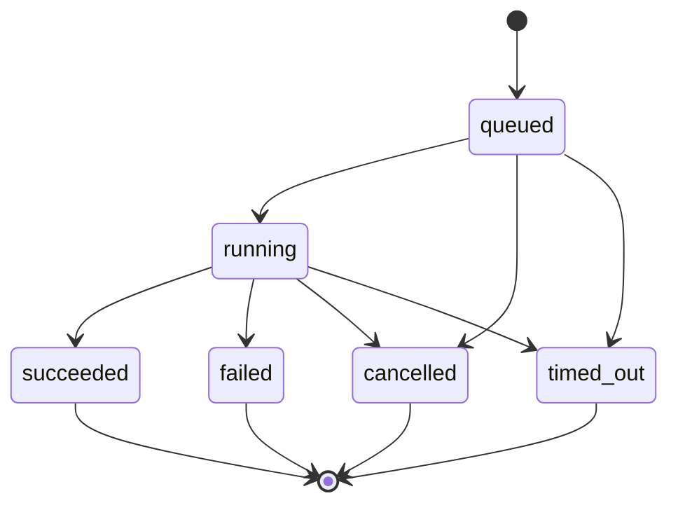

# 应用界面实时与异步事件协议

- Figma 文件：[应用界面 Copy](https://www.figma.com/design/lWtoH8PCoOoPP3ttwMUBP6/应用界面--Copy-)
- 编写日期：2026-07-14
- 当前版本：`Draft v0.1`
- 依据：[04-interaction-matrix.csv](./04-interaction-matrix.csv)、[05-data-dictionary.md](./05-data-dictionary.md)、[06-api-requirements.md](./06-api-requirements.md)
- 用途：统一前端、后端和测试人员对异步任务、流式回复、Monitor 实时数据和断线恢复的理解

## 1. 这份文件解决什么问题

很多页面在用户点击按钮后不能立即得到最终结果，例如：

- State 生成对话回复。
- TaskRun 执行任务。
- TestRun 测试或重测 State。
- ValidationRun 验证 Skill。
- ImportJob 扫描仓库或文件。
- ExportJob 生成导出包。
- Monitor 持续更新健康、Token、API 和日志。

如果每个模块自行设计状态和事件，前端会出现重复运行、进度倒退、刷新后丢失任务、断线后漏消息等问题。本文件定义一套共同协议，同时保留各业务对象自己的阶段和 payload。

## 2. 已确定的技术方向

| 编号 | 决定 | 原因 |
|---|---|---|
| RT-01 | 首版服务端推送使用 SSE | 当前主要是服务端向客户端单向推送，浏览器原生支持重连和事件 ID |
| RT-02 | 控制命令继续使用普通 HTTP API | 创建、重试、保存、取消等命令需要标准鉴权、幂等和错误响应 |
| RT-03 | 所有异步对象都有可查询的状态 API | SSE 不是唯一真相来源，刷新或游标过期后可重新获取完整状态 |
| RT-04 | 事件采用至少一次投递 | 允许重复，前端通过 `stream_id + sequence` 去重 |
| RT-05 | 只保证单个 stream 内有序 | 不承诺不同 Run、Conversation 或 State 之间的全局顺序 |
| RT-06 | 统一使用 `operation_status` 判断生命周期 | Task、Test、Import、Export 等都可使用同一恢复逻辑 |
| RT-07 | 业务阶段使用 `domain_status` 或 `stage` | 保留 Import 的 reading/checking、Export 的 packaging 等差异 |
| RT-08 | 连接中断不得创建新 Run | 重新连接原事件流；只有用户主动 Retry/Run again 才创建新 ID |
| RT-09 | 终态 Run 不得原地重新启动 | Retry/Run again 创建新 Run，并引用原 Run ID |
| RT-10 | TestRun 成功不得触发隐式 Publish/Activate | 测试结果和版本发布是两个独立动作 |
| RT-11 | State 安装完成状态为 `installed_inactive` | 安装不得发送 activation 事件；用户必须在 Lab 主动激活 |

SSE 是首版实现建议。如果后端已有可靠的 WebSocket 基础设施，可以在不改变本文事件 envelope、顺序、去重和恢复语义的前提下替换传输层。

## 3. 通用 Operation 模型

### 3.1 Operation 不是新的业务实体

`Operation` 是 TaskRun、TestRun、ValidationRun、ImportJob、ExportJob、ResponseRun 和短时生成任务的共同读取模型。数据库不一定需要单独建立 Operation 表，但 API 必须能返回这些共同字段。

| 字段 | 类型 | 必填 | 说明 |
|---|---|---:|---|
| `operation_id` | ID | 是 | 对应具体 Run/Job ID |
| `operation_type` | enum | 是 | `task_run`、`test_run`、`validation_run`、`import_job`、`export_job`、`response_run`、`generation_job` |
| `operation_status` | enum | 是 | 统一生命周期状态 |
| `domain_status` | string/null | 否 | 业务特有状态，例如 `checking_permissions` |
| `stage` | string/null | 否 | 当前可展示阶段 |
| `progress` | decimal | 是 | `0` 至 `1`；无法估算时允许为 null，但必须返回 stage |
| `status_url` | string | 是 | 完整状态查询地址 |
| `events_url` | string | 是 | SSE 事件地址 |
| `result_url` | string/null | 否 | 成功后结果地址 |
| `previous_operation_id` | ID/null | 否 | Retry/Run again 的来源 Operation |
| `error` | object/null | 否 | 终态失败的稳定错误信息 |
| `created_at` | timestamp | 是 | 创建时间 |
| `started_at` | timestamp/null | 否 | 开始执行时间 |
| `completed_at` | timestamp/null | 否 | 进入终态时间 |
| `latest_sequence` | integer | 是 | 当前已经持久化的最后事件序号 |

### 3.2 统一生命周期



| `operation_status` | 是否终态 | 说明 |
|---|---:|---|
| `queued` | 否 | 已创建，等待执行资源 |
| `running` | 否 | 正在执行，具体阶段由 `stage` 表示 |
| `succeeded` | 是 | 成功并可读取结果 |
| `failed` | 是 | 失败，必须返回稳定错误码 |
| `cancelled` | 是 | 被用户或系统取消 |
| `timed_out` | 是 | 超过执行上限 |

ImportJob 的 `ready`、ExportJob 的 `completed` 都映射为 `operation_status=succeeded`；原业务词保存在 `domain_status`。这样前端可以统一判断任务是否结束。

### 3.3 允许与禁止的变化

允许：

```text
queued -> running -> succeeded
queued -> running -> failed
queued -> cancelled
running -> cancelled
running -> timed_out
```

禁止：

```text
succeeded -> running
failed -> running
cancelled -> running
progress 0.80 -> progress 0.60
completed_at 已填写 -> completed_at 清空
```

Retry、Resume after failure、Run again 都创建新的 Operation ID。网络断线后的 Resume subscription 只是恢复订阅，不创建新 Operation。

## 4. 订阅入口

| 事件域 | SSE endpoint | 完整状态 endpoint | 对应 API-ID |
|---|---|---|---|
| TaskRun | `/task-runs/{task_run_id}/events` | `/task-runs/{task_run_id}` | `API-049`、`API-050` |
| TestRun | `/test-runs/{test_run_id}/events` | `/test-runs/{test_run_id}` | `API-101`、`API-102` |
| ValidationRun | `/validation-runs/{validation_run_id}/events` | `/validation-runs/{validation_run_id}` | `API-086`、`API-087` |
| Conversation | `/conversations/{conversation_id}/events` | `/conversations/{conversation_id}` | `API-026`、`API-029` |
| Monitor | `/states/{state_id}/monitor/events` | `/states/{state_id}/monitor` | `API-014`、`API-015` |
| 通用 Operation | `/operations/{operation_id}/events` | `/operations/{operation_id}` | `API-012`、`API-127` |
| Runtime/Autosave | `/runtime/events` | `/runtime/status` | `API-011`、`API-128` |

### 4.1 建立连接

```http
GET /api/v1/test-runs/testrun_01/events?after_sequence=41 HTTP/1.1
Accept: text/event-stream
Authorization: Bearer <access_token>
Last-Event-ID: stream_testrun_01:41
Cache-Control: no-cache
```

响应必须包含：

```http
HTTP/1.1 200 OK
Content-Type: text/event-stream
Cache-Control: no-cache, no-transform
Connection: keep-alive
X-Accel-Buffering: no
```

反向代理、CDN 和应用服务器不得缓冲 SSE 数据。

### 4.2 浏览器鉴权方式

浏览器原生 `EventSource` 不能自定义 `Authorization` 请求头，因此前后端必须在以下方案中选定一种：

| 方案 | 适用情况 | 要求 |
|---|---|---|
| `fetch()` 读取 SSE stream | 继续使用 Bearer token，推荐首版采用 | 前端负责解析 SSE 帧、重连和 `Last-Event-ID` |
| 同源 HttpOnly Cookie + 原生 EventSource | Web 端已有 Cookie Session | Cookie 必须为 `Secure`、`HttpOnly`、合适的 `SameSite`，并防止 CSRF |
| 短期订阅票据 | 跨域或特殊客户端 | 先用受保护 API 换取一次性短期 ticket；ticket 不得写普通访问日志 |

禁止把长期 access token 直接放入 SSE URL 查询参数。本文示例使用 Bearer header，因此默认前端实现是基于 `fetch()` 的 SSE client。

若采用原生 EventSource，首次连接通过 `after_sequence` 查询参数指定游标，浏览器自动重连时再使用原生 `Last-Event-ID`。由于原生 EventSource 不方便读取非 200 错误体，连接失败后客户端还必须调用完整状态 GET 判断是 Session 过期、权限失败还是游标过期。

## 5. 事件 Envelope

### 5.1 统一结构

| 字段 | 类型 | 必填 | 说明 |
|---|---|---:|---|
| `event_id` | ID | 是 | 全局唯一事件 ID |
| `stream_id` | string | 是 | 稳定 stream 标识，例如 `test_run:testrun_01` |
| `sequence` | integer | 是 | 单个 stream 内从 1 开始严格递增 |
| `event_type` | string | 是 | 点分命名，例如 `operation.progress` |
| `schema_version` | integer | 是 | 当前为 `1` |
| `resource_type` | string | 是 | 对应资源类型 |
| `resource_id` | ID | 是 | 对应资源 ID |
| `operation_id` | ID/null | 否 | 属于异步 Operation 时填写 |
| `correlation_id` | ID/null | 否 | 关联原请求、父 Operation 或业务链路 |
| `operation_status` | enum/null | 否 | 事件发生后的统一状态 |
| `domain_status` | string/null | 否 | 业务状态 |
| `stage` | string/null | 否 | 当前阶段 |
| `progress` | decimal/null | 否 | 事件发生后的总进度 |
| `payload` | object | 是 | 事件特有数据 |
| `occurred_at` | timestamp | 是 | 服务端事件时间 |

### 5.2 SSE 线格式

```text
id: test_run:testrun_01:42
event: operation.progress
data: {"event_id":"evt_01","stream_id":"test_run:testrun_01","sequence":42,"event_type":"operation.progress","schema_version":1,"resource_type":"test_run","resource_id":"testrun_01","operation_id":"testrun_01","operation_status":"running","domain_status":"researching","stage":"research","progress":0.63,"payload":{"message":"Analyzing sources","completed_units":63,"total_units":100},"occurred_at":"2026-07-14T10:21:32Z"}

```

每个事件块以空行结束。SSE 的 `id` 必须能还原 `stream_id + sequence`，但客户端仍以 JSON 中的字段为准。

### 5.3 Heartbeat

服务端在没有业务事件时定期发送注释 heartbeat，建议间隔 15 至 30 秒：

```text
: heartbeat 2026-07-14T10:21:32Z

```

Heartbeat 不增加业务 `sequence`，也不写入事件存储。

## 6. 投递、顺序和去重

### 6.1 服务保证

| 项目 | 保证 |
|---|---|
| 投递语义 | 至少一次，允许重复 |
| 顺序 | 同一 `stream_id` 内按 `sequence` 严格递增 |
| 跨 stream 顺序 | 不保证 |
| 持久化顺序 | 事件先持久化，再向客户端推送 |
| 终态事件 | 一个 Operation 只能有一个最终终态事件 |
| 完整状态 | 状态查询结果必须不早于其返回的 `latest_sequence` |
| 重放 | 在保留窗口内按 `after_sequence` 重放遗漏事件 |

### 6.2 前端去重规则

前端为每个 `stream_id` 保存 `last_applied_sequence`：

```text
收到 sequence <= last_applied_sequence
  -> 丢弃重复事件

收到 sequence = last_applied_sequence + 1
  -> 应用事件并更新 last_applied_sequence

收到 sequence > last_applied_sequence + 1
  -> 暂停应用，重新连接并请求缺失区间
```

只使用 `event_id` 去重不够，因为客户端还需要检测序号缺口。

### 6.3 进度规则

- `progress` 范围为 `0` 至 `1`。
- 同一 Operation 的 progress 不得倒退。
- `queued` 通常为 `0`。
- `succeeded` 必须为 `1`。
- `failed`、`cancelled`、`timed_out` 可保留最后进度，不强制为 `1`。
- 无法估算时 `progress=null`，但 `stage` 和 `domain_status` 必须可用。
- 高频进度事件应节流，建议页面可见时每 250 至 1000 毫秒最多推送一次。

## 7. 断线与页面刷新恢复

### 7.1 客户端恢复算法

```text
1. 从 URL、页面状态或本地持久化中找到 operation_id/resource_id。
2. GET 完整状态 endpoint。
3. 读取 operation_status 和 latest_sequence。
4. 若是终态，直接加载 result_url，不建立 SSE。
5. 若非终态，从 last_applied_sequence 建立 SSE。
6. 收到遗漏事件后按 sequence 应用。
7. 收到终态事件后关闭 SSE，并再次 GET 最终结果。
```

刷新页面不得调用创建 Run 的 POST 接口。`INT-007` 的恢复只能调用 GET 状态和 SSE 订阅。

### 7.2 自动重连退避

建议客户端采用：

```text
0s -> 1s -> 2s -> 5s -> 10s -> 20s -> 30s
```

- 每次等待加入少量随机抖动，避免大量客户端同时重连。
- 连接成功并稳定收到事件后重置退避。
- `401` 不重试 SSE，先刷新 Session 或进入登录页。
- `403`、`404` 不自动重试。
- `429`、`503` 优先使用 `Retry-After`。
- 页面离线时显示 `Reconnecting` 和最后更新时间，不伪装为 Live。

### 7.3 游标过期

事件超过保留窗口时返回：

```json
{
  "error": {
    "code": "EVENT_CURSOR_EXPIRED",
    "message": "The requested event cursor is no longer available.",
    "retryable": true,
    "details": {
      "latest_sequence": 912,
      "status_url": "/api/v1/test-runs/testrun_01"
    }
  }
}
```

前端应丢弃局部事件缓存，重新 GET 完整状态，再从响应的 `latest_sequence` 建立新连接。

## 8. 通用 Operation 事件

| event_type | 何时发送 | payload 最低字段 |
|---|---|---|
| `operation.queued` | Operation 创建并成功入队 | `queue_position?`、`estimated_start_at?` |
| `operation.started` | 首次开始执行 | `worker_region?` |
| `operation.stage_changed` | 当前阶段发生变化 | `previous_stage`、`stage`、`stage_label` |
| `operation.progress` | 总进度或阶段进度变化 | `message?`、`completed_units?`、`total_units?` |
| `operation.log` | 产生用户可见日志 | `level`、`message`、`code?` |
| `artifact.created` | 生成可读取 Artifact | `artifact_id`、`artifact_type`、`name` |
| `operation.succeeded` | 成功进入终态 | `result_url`、`summary?` |
| `operation.failed` | 失败进入终态 | `error.code`、`error.message`、`retryable` |
| `operation.cancelled` | 取消进入终态 | `cancelled_by`、`reason?` |
| `operation.timed_out` | 超时进入终态 | `timeout_seconds`、`retryable` |

`operation.log` 只发送面向用户或排障人员的安全日志，不得发送堆栈、密钥、完整请求头、私有 Source 内容或模型隐藏提示词。

## 9. TaskRun 事件

### 9.1 阶段

| stage | 页面含义 | 可跳过 |
|---|---|---:|
| `init` | 初始化并锁定输入 | 否 |
| `context_set` | 读取 Source 和 Context | 否 |
| `research` | 检索和分析 | 视任务 |
| `draft` | 生成初稿 | 否 |
| `refine` | 优化结果 | 是 |
| `review` | 检查质量和约束 | 否 |
| `output` | 生成最终 Artifact | 否 |

跳过阶段时发送 `task.stage_skipped`，前端不得把跳过误显示为失败。

### 9.2 专属事件

| event_type | payload 最低字段 | 前端作用 |
|---|---|---|
| `task.stage_started` | `stage`、`stage_label` | 激活 State Chain 节点 |
| `task.stage_completed` | `stage`、`duration_ms` | 标记节点完成 |
| `task.stage_skipped` | `stage`、`reason` | 标记跳过 |
| `task.checkpoint_saved` | `checkpoint_id`、`stage` | 告知后端存在可恢复点 |
| `task.metric_updated` | `token_usage?`、`elapsed_ms` | 更新执行摘要 |
| `artifact.created` | `artifact_id`、`name`、`mime_type` | 在结果区域显示新文件 |

### 9.3 Retry 与 Resume

- 原 TaskRun 保持终态和原日志不变。
- POST Retry 返回新的 `task_run_id`。
- 新 TaskRun 使用 `previous_task_run_id` 或共同字段 `previous_operation_id` 关联原 Run。
- 可复用已完成阶段的内部缓存，但新 Run 仍必须产生自己的事件序列。
- 前端收到创建响应后切换到新 stream，不在原 stream 等待重新运行。

对应交互：`INT-050`、`INT-051`、`INT-052`。

## 10. TestRun 事件

### 10.1 固定阶段

```text
understand -> plan -> research -> synthesize -> validate -> output
```

| stage | 页面标签 | 主要产物 |
|---|---|---|
| `understand` | Understand | 任务理解与约束 |
| `plan` | Plan | 执行计划 |
| `research` | Research | 检索或分析结果 |
| `synthesize` | Synthesize | 结构化草稿 |
| `validate` | Validate | 质量、安全和约束校验 |
| `output` | Output | TestResult 和 Artifact |

### 10.2 专属事件

| event_type | payload 最低字段 | 前端作用 |
|---|---|---|
| `test.stage_started` | `stage`、`stage_label` | 激活测试时间线节点 |
| `test.stage_completed` | `stage`、`duration_ms` | 显示阶段耗时和完成勾选 |
| `test.metric_updated` | `metric`、`value`、`max_value` | 更新实时指标 |
| `test.takeaway_created` | `takeaway_id`、`title` | 可选地预载入结果摘要 |
| `test.result_created` | `test_result_id`、`overall_score` | 准备打开结果页 |
| `artifact.created` | Artifact 摘要 | 显示可预览输出 |

`operation.succeeded` 只表示 TestRun 完成。它不得触发：

- `state.published`
- `state.activated`
- `installation.activated`

Save & Re-test、Run Lab Test、Run Test 和 Run test again 都使用相同 TestRun 事件协议。对应交互：`INT-061`、`INT-062`、`INT-063`、`INT-072`、`INT-122`、`INT-123`、`INT-124`、`INT-127`。

## 11. ValidationRun 事件

### 11.1 阶段

```text
prepare -> run_tests -> aggregate -> review
```

### 11.2 专属事件

| event_type | payload 最低字段 | 说明 |
|---|---|---|
| `validation.test_started` | `test_case_id`、`test_set_id` | 单个测试开始 |
| `validation.test_completed` | `test_case_id`、`result`、`duration_ms` | `result` 为 pass/review/fail |
| `validation.counters_updated` | `tests_count`、`pass_count`、`review_count`、`fail_count` | 更新页面顶部统计 |
| `validation.metric_updated` | `metric`、`base_value?`、`draft_value`、`change?` | 更新 Performance 对比 |
| `validation.review_item_created` | `review_item_id`、`category`、`severity`、`title` | 增加 Review Item |
| `validation.summary_created` | `readiness`、`blocking_count` | 准备发布前摘要 |

`review_count > 0` 是系统校验结果，不等于人工审核。当前阶段不发送 `approval.requested` 或 `approval.approved` 事件。

对应交互：`INT-090`、`INT-102`、`INT-103`、`INT-104`、`INT-105`、`INT-106`。

## 12. ImportJob 事件

### 12.1 状态映射

| operation_status | domain_status | 说明 |
|---|---|---|
| `queued` | `queued` | 等待读取 |
| `running` | `reading` | 读取仓库或文件 |
| `running` | `checking_schema` | 检查结构 |
| `running` | `checking_permissions` | 检查权限 |
| `running` | `checking_dependencies` | 检查依赖 |
| `succeeded` | `ready` | 可转换为 SkillDraft |
| `succeeded` | `needs_review` | 扫描完成，但有项目需要用户确认 |
| `failed` | `failed` | 无法完成导入 |

`needs_review` 是成功完成扫描后的业务结果，因此统一状态为 `succeeded`，不是技术失败。

### 12.2 专属事件

| event_type | payload 最低字段 |
|---|---|
| `import.source_read` | `source_type`、`file_count?`、`branch?` |
| `import.check_started` | `check_id`、`check_type` |
| `import.check_completed` | `check_id`、`result`、`summary`、`review_item_id?` |
| `import.capability_detected` | `capability_code`、`name`、`confidence` |
| `import.readiness_updated` | `score`、`blocking_count` |
| `import.ready` | `convert_to_draft_url` |
| `import.needs_review` | `review_count`、`review_url` |

对应交互：`INT-071`、`INT-092`、`INT-093`、`INT-094`、`INT-095`、`INT-096`。

## 13. ExportJob 事件

### 13.1 状态映射

| operation_status | domain_status | 说明 |
|---|---|---|
| `queued` | `queued` | 等待导出资源 |
| `running` | `rendering` | 渲染目标格式 |
| `running` | `packaging` | 打包多个文件 |
| `running` | `uploading` | 上传到下载存储 |
| `succeeded` | `completed` | 下载地址可用 |
| `failed` | `failed` | 导出失败 |

`expired` 不是 Operation 重新变化。ExportJob 仍保留成功历史，但 `download_url` 已失效，查询时返回 `domain_status=expired`。用户重新导出会创建新的 ExportJob。

### 13.2 专属事件

| event_type | payload 最低字段 |
|---|---|
| `export.render_started` | `format` |
| `export.file_processed` | `filename`、`index`、`total` |
| `export.package_created` | `filename`、`size_bytes` |
| `export.file_ready` | `download_url`、`expires_at`、`checksum` |
| `export.failed` | `error.code`、`retryable` |

分享链接由同步 ShareLink API 创建，不应把永久分享 token 放入 SSE payload。对应交互：`INT-037`、`INT-113`、`INT-126`。

## 14. Conversation 流式回复

### 14.1 ResponseRun 生命周期

```text
queued -> generating -> succeeded
                     -> failed
                     -> cancelled
```

`generating` 映射为 `operation_status=running`。

### 14.2 事件目录

| event_type | payload 最低字段 | 说明 |
|---|---|---|
| `reply.started` | `response_run_id`、`assistant_message_id` | 先创建空的 assistant Message |
| `reply.delta` | `assistant_message_id`、`delta`、`content_index` | 追加文本，不发送完整累计文本 |
| `reply.citation_added` | `assistant_message_id`、`citation` | 添加来源引用 |
| `reply.tool_status` | `tool_name`、`status`、`label` | 只展示安全的工具状态 |
| `reply.completed` | `assistant_message_id`、`finish_reason`、`usage_summary` | Message 进入完成状态 |
| `reply.failed` | `assistant_message_id`、`error.code`、`retryable` | 保留已接收内容并提供重试 |

### 14.3 Delta 合并

- `content_index` 在单个 assistant Message 内递增。
- 前端仍以 stream `sequence` 检测丢包。
- 重复 delta 必须因重复 sequence 被丢弃，不能重复拼接。
- 完成后以前端再次 GET Message 的持久化完整内容为最终真相。
- `reply.failed` 时不得删除已经收到的部分内容。
- Continue/Retry 创建新的 `response_run_id`，并通过 `previous_operation_id` 关联。

### 14.4 示例

```text
id: conversation:conv_01:18
event: reply.delta
data: {"event_id":"evt_18","stream_id":"conversation:conv_01","sequence":18,"event_type":"reply.delta","schema_version":1,"resource_type":"conversation","resource_id":"conv_01","operation_id":"resp_01","operation_status":"running","domain_status":"generating","stage":"response","progress":null,"payload":{"assistant_message_id":"msg_02","delta":"The strongest opportunity is","content_index":7},"occurred_at":"2026-07-14T10:21:32Z"}

```

对应交互：`INT-030`、`INT-031`、`INT-032`、`INT-033`、`INT-039`。

## 15. Monitor 与 System Stream

Monitor 是持续流，不使用 Operation 终态。`stream_id` 建议为 `monitor:{state_id}`。

### 15.1 事件目录

| event_type | payload 最低字段 | 前端作用 |
|---|---|---|
| `monitor.snapshot` | health、usage、API、activity 摘要 | 首次连接或恢复后的基准数据 |
| `monitor.health_changed` | `previous_status`、`status`、`checked_at` | 更新 State Health |
| `monitor.usage_changed` | token balance/limit、window | 更新 Token 卡片 |
| `monitor.api_changed` | active count、limit、API summary | 更新 Active APIs |
| `monitor.activity_created` | activity ID、type、summary | 添加 Recent Activity |
| `monitor.log` | level、code、safe message、timestamp | 添加 System Stream 行 |
| `monitor.connection_state` | state、checked_at | 更新 All systems normal/异常状态 |

### 15.2 Snapshot 与增量

1. 页面先 GET `/states/{state_id}/monitor` 获取完整 snapshot 和 `latest_sequence`。
2. 再从该 sequence 建立 SSE。
3. `monitor.snapshot` 可在服务端检测到长时间断线时重新发送。
4. 前端应用 snapshot 后替换整个 Monitor 本地状态，再应用后续增量。
5. 返回 Home 时关闭详情流；Home 可建立更低频的摘要流。

### 15.3 日志限制

- System Stream 默认只返回用户可理解的安全日志。
- 日志 payload 不包含访问令牌、API key、完整 Source、私有 prompt 或堆栈。
- 高频日志应在服务端聚合或采样。
- 历史日志通过普通分页查询加载，SSE 只负责新增日志。

对应交互：`INT-016`、`INT-018`、`INT-019`、`INT-148`、`INT-149`、`INT-150`、`INT-151`、`INT-152`、`INT-153`。

## 16. Runtime、Live 与 Autosave

Runtime 流用于页面顶部的 Live、Autosaved、Reconnecting 状态，不承载业务结果。

| event_type | payload 最低字段 |
|---|---|
| `runtime.connection_changed` | `connection_state`、`checked_at` |
| `runtime.autosave_started` | `resource_type`、`resource_id`、`revision` |
| `runtime.autosave_succeeded` | `resource_type`、`resource_id`、`revision`、`saved_at` |
| `runtime.autosave_failed` | `resource_type`、`resource_id`、`revision`、`error.code` |
| `runtime.revision_changed` | `resource_type`、`resource_id`、`revision`、`actor_type` |

要求：

- 显示 `Autosaved` 只能依据后端确认的 `autosave_succeeded`，不能仅依据前端防抖计时器。
- Autosave 仍必须校验 revision。
- `runtime.autosave_failed` 时保留本地修改，并显示可重试状态。
- SSE 断线不等于后端业务失败，页面应显示 `Reconnecting`。

对应交互：`INT-006`。

## 17. 通用 Generation Operation

以下动作不是完整 TaskRun/TestRun，但仍可能需要数秒：

- TaskDraft Quick Action：`INT-048`
- State 目标分析：`INT-068`
- State Match：`INT-131`、`INT-132`
- Source 解析：`INT-043`、`INT-044`、`INT-119`

它们使用 `operation_type=generation_job` 或对应 Job 类型，并订阅 `/operations/{operation_id}/events`。最低事件集合为：

```text
operation.queued
operation.started
operation.progress
operation.succeeded 或 operation.failed
```

若 Operation 产生对 Draft 的建议，成功事件只返回 `suggestion_id`、`base_revision` 和 patch 预览。后端不得直接静默覆盖用户在 Operation 执行期间的新编辑。

## 18. 错误、取消和重试

### 18.1 失败事件结构

```json
{
  "error": {
    "code": "SOURCE_PARSE_FAILED",
    "message": "One source could not be parsed.",
    "retryable": true,
    "failed_stage": "context_set",
    "details": {
      "source_id": "src_01..."
    }
  }
}
```

`details` 必须经过权限和脱敏检查。

### 18.2 连接错误与业务错误分离

| 情况 | Operation 状态 | 前端处理 |
|---|---|---|
| SSE 网络断开 | 不改变 | 显示 Reconnecting，恢复原 stream |
| 客户端主动关闭页面 | 不改变 | 下次通过状态 API 恢复 |
| 后端 worker 失败 | `failed` | 发送 `operation.failed`，展示 Retry |
| 超时 | `timed_out` | 展示超时原因和是否可重试 |
| 用户取消 | `cancelled` | 保留日志和已生成 Artifact |
| Session 过期 | 不改变 Operation | 重新认证后继续读取原 Operation |

### 18.3 Cancel 与 Pause

当前页面没有完整的 Pause/Resume 产品流程，因此首版不要求 Pause 状态。若页面提供 Cancel，取消命令应：

1. 使用幂等键。
2. 返回当前 Operation。
3. 最终通过 `operation.cancelled` 确认取消完成。
4. 无法取消时返回 `RUN_NOT_CANCELLABLE`，不得伪造 cancelled。

## 19. 安全与隐私

### 19.1 鉴权

- 建立 SSE 时执行与完整状态 GET 相同的资源权限校验。
- 长连接期间 Session 到期时关闭连接，前端刷新 Session 后重新连接。
- 用户失去资源权限时，服务端立即终止该 stream。
- 不允许只凭 operation ID 订阅事件。

### 19.2 Payload 分级

| 数据 | SSE 中的处理 |
|---|---|
| 密码、Token、API key | 永不发送 |
| 私有 Source 内容 | 默认不发送全文，只发送 Source ID 和安全摘要 |
| 对话 delta | 仅会话授权用户可见 |
| Artifact 下载 URL | 优先通过受保护 GET 获取，不长期放在事件中 |
| 系统堆栈和内部 prompt | 永不发送 |
| Monitor 日志 | 脱敏、采样、按用户权限裁剪 |

### 19.3 限流与背压

- 限制单用户、单设备和单 State 的并发 SSE 连接数。
- 同一页面尽量复用一个 stream，不为每个卡片建立独立连接。
- 高频指标在服务端合并后推送。
- 慢客户端达到缓冲上限时关闭连接，让客户端从 sequence 恢复。
- 服务端不得因客户端断线取消仍应继续的 TaskRun/TestRun。

## 20. 前端状态归并规则

前端不得把每个事件直接当成页面完整状态。推荐按以下优先级归并：

```text
完整状态 GET 响应
  + sequence 更大的已持久化事件
  + 尚未提交的本地输入
= 当前页面显示状态
```

规则：

1. 服务器事件不能覆盖用户尚未提交的表单字段。
2. Draft 建议携带 `base_revision`，revision 不一致时要求用户确认。
3. 终态事件到达后再 GET result，避免只凭事件 payload 拼接最终结果。
4. 页面路由只在收到创建 API 响应中的 Run ID 后跳转，不等待第一条 SSE。
5. 事件晚到时，根据 sequence 决定是否应用，不根据客户端接收时间排序。

## 21. 验收测试清单

### 21.1 通用协议

| 测试场景 | 预期结果 |
|---|---|
| 重复收到同一 sequence | 页面只应用一次 |
| 收到 sequence 缺口 | 暂停后续应用并补拉缺失事件 |
| SSE 断线 30 秒后恢复 | 不创建新 Run，进度和日志连续 |
| 页面刷新 | GET 原 Operation 并继续订阅 |
| 游标已过期 | GET 完整状态并从新 sequence 继续 |
| Operation 已终态 | 直接加载结果，不保持无意义 SSE |
| 两个 Operation 同时运行 | 各自 stream 顺序正确，互不覆盖 |
| Session 过期 | Operation 继续运行，重新登录后可恢复 |

### 21.2 关键产品规则

| 测试场景 | 预期结果 |
|---|---|
| Save & Re-test 重复点击 | 一个 TestRun、一个 stream |
| TestRun 成功 | 只生成 TestResult，不发布或激活 State |
| Run test again | 新 TestRun ID，引用旧 TestRun |
| ValidationRun 有 review items | 显示 Review，不创建人工审批状态 |
| 安装 State | 不产生 activation 事件 |
| 对话断线重连 | delta 不重复、不丢失，最终 Message 完整 |
| Monitor 日志突增 | 页面不卡顿，服务端执行采样或聚合 |
| Autosave 失败 | 不显示 Autosaved，保留本地输入 |

### 21.3 合同测试

后端至少提供以下自动化合同测试：

1. 所有事件都能通过 EventEnvelope schema 校验。
2. 同一 stream 的 sequence 唯一且单调递增。
3. 终态 Operation 只有一个终态事件。
4. 状态 API 的 `latest_sequence` 与事件存储一致。
5. `after_sequence` 重放的第一条事件为请求序号加一。
6. 无权限用户无法通过猜测 ID 订阅 stream。
7. 敏感字段扫描不会在 event payload 中发现 Token、密码或密钥。
8. schema_version 未识别时客户端可忽略未知字段而不崩溃。

## 22. 交互覆盖

本协议直接覆盖以下实时与异步关键交互：

| 分组 | 交互编号 |
|---|---|
| 全局恢复与 Live | `INT-006`、`INT-007` |
| Home/Monitor | `INT-016`、`INT-018`、`INT-019`、`INT-148`、`INT-149`、`INT-150`、`INT-151`、`INT-152`、`INT-153` |
| 对话 | `INT-030`、`INT-031`、`INT-032`、`INT-033`、`INT-039` |
| Task | `INT-048`、`INT-050`、`INT-051`、`INT-052` |
| State 调整与创建 | `INT-061`、`INT-062`、`INT-063`、`INT-068`、`INT-071`、`INT-072` |
| Skill | `INT-090`、`INT-092`、`INT-093`、`INT-102`、`INT-103`、`INT-104`、`INT-105`、`INT-106`、`INT-113` |
| State Test | `INT-122`、`INT-123`、`INT-124`、`INT-126`、`INT-127` |
| State Match | `INT-131`、`INT-132` |

以下名称包含“恢复”，但不属于本协议的持续事件流：

- `INT-029` 恢复最近 Conversation：普通查询或创建接口。
- `INT-065` 恢复 StateDraft：普通查询接口。
- `INT-145` Restore StateVersion：高风险原子写入，只基于历史版本创建新的 StateDraft；Current State 保持不变。完成后通过 Ledger 查询 Draft 和审计事件，不把它当作 Run。

## 23. 仍需后端确认的参数

以下参数不改变协议结构，但必须在开发前写入环境配置和运维文档：

1. SSE heartbeat 间隔。
2. RunEvent、MonitorEvent 和 Conversation Event 的保留时长。
3. 每个用户、设备和 State 的最大并发 SSE 连接数。
4. TaskRun、TestRun、ValidationRun、ImportJob 和 ExportJob 的超时时间。
5. 自动重试由后端执行还是只允许用户主动 Retry。
6. Operation 事件存储的容量、归档和清理策略。
7. Monitor 日志采样率和普通用户可见级别。
8. progress 无法准确计算时的展示文案责任由前端还是后端提供。
9. ExportJob 完成后下载地址的有效期。
10. 是否为移动端或旧客户端提供轮询模式开关。

## 24. 下一份交付物

下一步制作 `08-error-and-empty-states.md`：把 API 错误码、异步失败、权限不足、无数据和断线状态逐页映射到用户可见文案、按钮状态和恢复动作。
