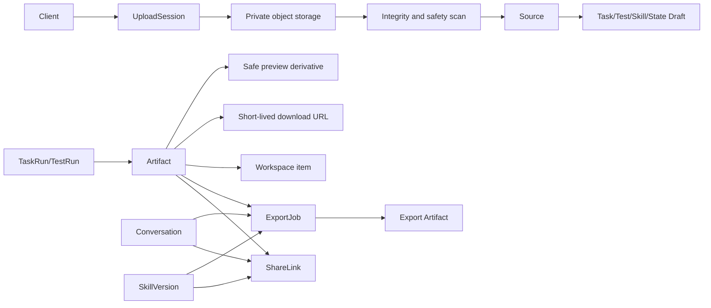
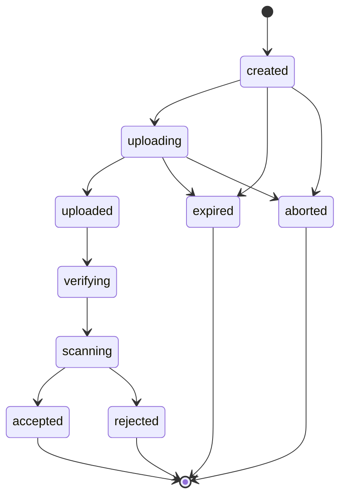

# 应用界面文件、上传、导出与分享规范

- Figma 文件：[应用界面 Copy](https://www.figma.com/design/lWtoH8PCoOoPP3ttwMUBP6/应用界面--Copy-)
- 编写日期：2026-07-14
- 当前版本：`Draft v0.1`
- 依据：[04-interaction-matrix.csv](./04-interaction-matrix.csv)、[05-data-dictionary.md](./05-data-dictionary.md)、[06-api-requirements.md](./06-api-requirements.md)、[07-realtime-and-async-events.md](./07-realtime-and-async-events.md)、[08-error-and-empty-states.md](./08-error-and-empty-states.md)、[09-permissions-and-roles.md](./09-permissions-and-roles.md)
- 用途：统一文件上传、Source 处理、Artifact 预览/下载、多格式导出和 ShareLink 的全生命周期

## 1. 这份文件解决什么问题

本产品中的“文件”并不是一个单一功能：

- 用户上传头像、Task Source、Test Context 或 Skill 文件。
- 用户粘贴文字、添加 URL、连接数据或导入 Git 仓库。
- 后端需要扫描、解析并把资料转成可供 State/Skill 使用的 Source。
- TaskRun/TestRun 产生 Artifact。
- 用户预览、打开、下载、导出或保存 Artifact 到 Workspace。
- 用户为 Conversation、Artifact 或 SkillVersion 创建可撤销 ShareLink。

如果这些流程各自实现，会出现权限绕过、重复存储、危险文件预览、过期链接仍可访问、导出格式前后端不一致等问题。本文件将其统一为一条受权限和审计保护的资源链路。

## 2. 核心原则

| 编号 | 原则 | 要求 |
|---|---|---|
| FS-01 | 原始文件默认私有 | 对象存储桶、storage key 和源 URL 不直接暴露 |
| FS-02 | 上传不等于可用 | 上传完成后必须通过完整性、安全扫描和必要解析 |
| FS-03 | 不信任客户端声明 | MIME、扩展名、文件大小和 checksum 都由后端复核 |
| FS-04 | 子资源继承父资源权限 | Source/Artifact 不能只凭 ID 读取或下载 |
| FS-05 | 预览使用安全派生文件 | 不直接内嵌可能执行脚本的原始文件 |
| FS-06 | 下载地址短期有效 | 每次下载前重新授权，再生成签名 URL |
| FS-07 | 导出格式由后端动态返回 | 前端不得硬编码“市场上所有格式” |
| FS-08 | ExportJob 锁定输入快照 | 原资源变化不改变已经运行的导出 |
| FS-09 | ShareLink 权限最小化 | 只授予声明的资源、动作和有效期 |
| FS-10 | 秘密不进 URL 和日志 | access token、仓库凭证、storage key、Share token 必须脱敏 |
| FS-11 | 单个文件失败不回滚其他文件 | 多文件上传按单行状态恢复 |
| FS-12 | 所有限制由后端声明 | 文件大小、类型、格式、保留期通过配置/API 返回 |

## 3. 统一资源关系



## 4. 统一对象

### 4.1 UploadSession

`UploadSession` 描述一次客户端到私有存储的上传，不等于最终 Source 或头像 Asset。

| 字段 | 类型 | 必填 | 说明 |
|---|---|---:|---|
| `upload_id` | ID | 是 | 上传会话 ID |
| `user_id` | ID | 是 | 发起用户 |
| `purpose` | enum | 是 | `avatar`、`task_source`、`test_source`、`skill_source`、`skill_import`、`audio` |
| `owner_type` | string/null | 否 | 目标 Draft/Conversation 类型 |
| `owner_id` | ID/null | 否 | 目标父资源 ID |
| `original_filename` | string | 是 | 经过规范化的显示文件名 |
| `declared_mime_type` | string | 是 | 客户端声明，仅供初筛 |
| `detected_mime_type` | string/null | 否 | 后端检测结果 |
| `declared_size_bytes` | integer | 是 | 客户端声明大小 |
| `verified_size_bytes` | integer/null | 否 | 后端确认大小 |
| `checksum_sha256` | string/null | 否 | 客户端可提前提交，完成时后端验证 |
| `status` | enum | 是 | 上传生命周期状态 |
| `storage_key` | string | 是 | 高敏私有对象键，不返回普通前端 |
| `multipart` | boolean | 是 | 是否分片上传 |
| `expires_at` | timestamp | 是 | 上传会话过期时间 |
| `created_at` | timestamp | 是 | 创建时间 |
| `completed_at` | timestamp/null | 否 | 上传确认时间 |

### 4.2 Source

Source 是被业务 Draft/Conversation 使用的资料。文件型 Source 引用已通过扫描的上传对象；text、URL、repository 和 data connector 使用各自的安全处理方式。

Source 需要在数据字典现有字段基础上补充：

| 字段 | 类型 | 必填 | 说明 |
|---|---|---:|---|
| `upload_id` | ID/null | 否 | 文件型 Source 的上传来源 |
| `original_filename` | string/null | 否 | 原文件显示名 |
| `checksum_sha256` | string/null | 否 | 文件内容校验值 |
| `scan_status` | enum | 是 | `not_required`、`pending`、`scanning`、`clean`、`blocked`、`failed` |
| `detected_mime_type` | string/null | 否 | 后端检测 MIME |
| `content_snapshot_id` | ID/null | 否 | URL/repository/connector 读取时锁定的快照 |
| `processing_status` | enum | 是 | 统一前端处理状态 |

`processing_status` 值：

```text
pending -> scanning -> parsing -> ready
                   -> unsafe
                             parsing -> failed
```

### 4.3 Artifact

Artifact 是 Run 或 ExportJob 生成的不可直接编辑结果。

建议补充字段：

| 字段 | 类型 | 必填 | 说明 |
|---|---|---:|---|
| `filename` | string | 是 | 下载时建议文件名 |
| `checksum_sha256` | string | 是 | 完整性校验 |
| `scan_status` | enum | 是 | 后端生成内容也必须经过适当检查 |
| `preview_artifact_id` | ID/null | 否 | 安全预览派生文件 |
| `source_snapshot` | object | 是 | 生成时锁定的资源、版本和选项摘要 |
| `retention_class` | enum | 是 | `temporary`、`workspace`、`versioned`、`audit` |

## 5. UploadSession 生命周期



| status | 说明 | 是否终态 |
|---|---|---:|
| `created` | 已返回上传目标，尚未开始 | 否 |
| `uploading` | 客户端正在直传 | 否 |
| `uploaded` | 客户端声明上传完成，尚未验证 | 否 |
| `verifying` | 后端检查对象、大小、分片和 checksum | 否 |
| `scanning` | 安全扫描中 | 否 |
| `accepted` | 可创建 Asset/Source | 是 |
| `rejected` | 文件不安全或不符合策略 | 是 |
| `expired` | 上传会话过期 | 是 |
| `aborted` | 用户或系统中止 | 是 |

## 6. 上传 API 流程

### 6.1 第一步：创建上传会话

`POST /api/v1/uploads`，对应 `API-123`。

```json
{
  "purpose": "task_source",
  "owner_type": "task_draft",
  "owner_id": "td_01...",
  "original_filename": "Q2-report.pdf",
  "declared_mime_type": "application/pdf",
  "declared_size_bytes": 2480012,
  "checksum_sha256": "optional-hex-value"
}
```

后端在返回上传地址前必须检查：

1. Session 与父资源 write 权限。
2. purpose 是否允许当前文件类别。
3. 声明大小是否超过当前配置限制。
4. 用户和父资源的存储/数量额度。
5. 文件名长度和危险字符。
6. 相同幂等键是否已经创建 UploadSession。

响应示例：

```json
{
  "data": {
    "upload_id": "upl_01...",
    "upload_method": "PUT",
    "upload_url": "https://storage.example/signed-upload...",
    "required_headers": {
      "Content-Type": "application/octet-stream"
    },
    "multipart": false,
    "expires_at": "2026-07-14T11:00:00Z",
    "limits": {
      "max_size_bytes": 52428800
    }
  }
}
```

`upload_url` 是短期凭证，不得写入分析事件或普通日志。

### 6.2 第二步：客户端直传

- 客户端只向后端返回的目标上传。
- 客户端不得自行构造 storage key。
- 大文件根据响应决定是否使用 multipart。
- 每个分片记录 part number 和 ETag。
- 上传进度只表示网络传输，不表示 Source 已可用。
- 用户取消后调用中止流程或等待 UploadSession 过期清理。

### 6.3 第三步：确认完成

`POST /api/v1/uploads/{upload_id}/complete`，对应 `API-124`。

```json
{
  "checksum_sha256": "hex-value",
  "parts": []
}
```

后端必须通过对象存储 HEAD/metadata 复核对象存在、大小、分片和 checksum。不能只相信 complete 请求。

成功后返回 Asset/Source 引用和处理状态：

```json
{
  "data": {
    "upload_id": "upl_01...",
    "status": "scanning",
    "asset_id": null,
    "source_id": "src_01...",
    "source_status_url": "/api/v1/sources/src_01..."
  }
}
```

### 6.4 上传恢复

- 创建接口必须支持 `Idempotency-Key`。
- 网络中断后，前端先查询 UploadSession/存储分片状态，不盲目新建上传。
- UploadSession 过期后创建新会话；不得复用过期签名 URL。
- 多文件上传每个文件拥有独立 upload ID。
- 单个失败不删除其他已成功文件。

## 7. 文件名、MIME 与大小校验

### 7.1 文件名

- 原始文件名只用于显示和建议下载名，不直接用作 storage key。
- 去除路径分隔符、控制字符、双向文字控制字符和结尾空格。
- 限制规范化后的长度。
- 下载响应使用安全的 `Content-Disposition` 编码。
- 重名文件由对象 ID 区分，不依赖自动追加 `(1)` 保证唯一性。

### 7.2 类型检测

后端综合检查：

1. 客户端声明 MIME。
2. 文件扩展名。
3. 文件 magic bytes/内容检测。
4. purpose 对应允许列表。

三者不一致时按更严格策略处理。禁止仅凭 `.pdf`、`.png` 等扩展名放行。

### 7.3 限制配置

具体数值由后端和产品确认，不在前端硬编码。限制至少区分：

| purpose | 需要的限制 |
|---|---|
| avatar | 图片类型、像素、文件大小、动画处理 |
| task/test source | 类型、单文件大小、单 Draft 数量、总页数/字符数 |
| skill source/import | 文件类型、归档层级、仓库大小、文件数量 |
| audio | 时长、编码、采样率、文件大小 |
| export | 输出总大小、文件数量、格式选项 |

API 返回限制和错误码，前端限制只用于提前提示。

## 8. 安全扫描与隔离

### 8.1 隔离区

新上传对象先进入不可被业务读取的 quarantine 区。只有 `scan_status=clean` 后才能：

- 创建可用头像 Asset。
- 进入 Source 解析。
- 被 Run 读取。
- 生成预览或下载地址。

### 8.2 检查范围

- 恶意软件和已知威胁扫描。
- 压缩炸弹、超深目录、递归归档和异常压缩比。
- 可执行文件、脚本、宏和嵌入对象。
- 文件格式与 MIME 不一致。
- 解析器已知漏洞防护和超时。
- 内容策略或企业安全策略需要的检查。

### 8.3 被阻止文件

- 返回 `SOURCE_UNSAFE` 或 `MALWARE_DETECTED`。
- 不向普通用户暴露扫描引擎内部签名细节。
- 不允许 Preview、Download 或继续解析。
- 按安全策略隔离或删除对象。
- 记录安全审计，但日志不包含文件全文。

扫描服务暂不可用时返回 `DEPENDENCY_UNAVAILABLE`，不得因为扫描失败而默认放行。

## 9. Source 创建与解析

### 9.1 File Source

```text
UploadSession.accepted
  -> Source.pending
  -> Source.parsing
  -> Source.ready 或 Source.failed
```

解析器输出至少包含：

- 文本/结构化内容的内部引用。
- 页数、字符数、表格数等安全 metadata。
- 检测语言和编码。
- 解析器版本。
- 内容快照 ID。
- 失败时稳定 error code。

前端不需要也不应获取内部索引、embedding 或临时解析存储地址。

### 9.2 Text Source

- 后端限制字符数和编码。
- 原文按敏感数据存储并继承父 Draft 权限。
- 保留创建时快照，后续 Draft 运行锁定 Source snapshot。
- HTML 粘贴内容先转为安全文本/受支持结构，不保存可执行脚本。

### 9.3 URL Source

服务端抓取必须防止 SSRF：

- 只允许产品支持的协议，默认 `https`/`http`。
- 禁止 localhost、link-local、私有网段和云 metadata 地址。
- 每次重定向重新解析和校验目标地址。
- 设置 DNS、连接、读取、总时长和最大响应大小限制。
- 不自动携带用户 Cookie 或内部服务凭证。
- 记录最终规范 URL 和内容快照，不依赖页面以后仍相同。

阻止时返回 `URL_FETCH_BLOCKED`，不要向用户展示内部网络结构。

### 9.4 Repository Source

- OAuth/token 由专用 secret store 保存，Source 只保存 connector reference。
- 默认只申请 read-only 最小 scope。
- 导入时锁定 repository、branch 和 commit SHA。
- 明确处理 submodule、Git LFS、私有依赖和大文件。
- 限制文件总数、仓库总大小、单文件大小和目录深度。
- 仓库不可访问与仓库内容校验失败使用不同错误码/检查项。
- 不执行仓库代码或安装依赖来“验证”Skill。

### 9.5 Data Connector Source

- 用户必须拥有 connector connection。
- 每个连接声明可读数据范围和最小权限。
- Source 保存 connector ID、查询/选择摘要和快照 ID，不保存 access token。
- Run 读取时按产品规则使用创建时快照或明确刷新；不得无提示读取新数据。
- 连接被撤销后，旧快照的保留和可用性按数据策略执行。

## 10. Source 附加和移除

### 10.1 附加

Task/Test/Skill 的 Source API 必须同时检查：

1. 当前用户对父 Draft 有 write 权限。
2. Source 属于当前用户或用户有合法读取权。
3. Source 已通过安全扫描。
4. Source 的 purpose/类型允许绑定到该父资源。
5. 父 Draft revision 正确。

禁止把其他用户的合法 source ID 附加到自己的 Draft，以此绕过 Source 权限。

### 10.2 移除

- 从 Draft 移除 Source 默认解除关联，不立即物理删除共享或仍被历史 Run 引用的对象。
- 已启动 Run 使用不可变 Source snapshot，不受后续移除影响。
- 没有任何引用且超过保留期后，后台生命周期任务删除底层对象。
- 删除和清理过程必须避免破坏 AuditLog、Published Version 或已保存 Workspace Item。

## 11. Artifact 生命周期

### 11.1 创建

Artifact 只能由受信任后端任务创建。创建时锁定：

- parent Run/Result。
- 生成来源版本。
- MIME 和文件名。
- size 和 checksum。
- scan status。
- retention class。

`artifact.created` 事件只返回安全摘要和 artifact ID，不长期包含下载 URL。

### 11.2 Preview

`GET /api/v1/artifacts/{artifact_id}/preview`，对应 `API-104`。

安全要求：

- 每次请求沿 parent Run 重新授权。
- PDF、Office、Markdown、HTML 等优先转换为安全预览派生文件。
- 不直接内嵌未经清理的 HTML、SVG、JavaScript 或宏文档。
- 预览响应使用严格 CSP、禁用脚本和外部资源加载。
- 预览失败不删除原 Artifact，可返回 `PREVIEW_UNAVAILABLE` 并允许下载原文件。

### 11.3 Open

Open 与 Preview 只有在目标是产品内部安全视图时可以直接导航。外部 URL 必须：

- 明确标识外部打开。
- 使用 `noopener`、`noreferrer` 等安全策略。
- 不把 Session/Share token 传播到 Referer。
- 对不受信任 URL 做协议和域名检查。

### 11.4 Download

`GET /api/v1/artifacts/{artifact_id}/download-url`，对应 `API-055`。

流程：

```text
验证 Session/ShareLink
  -> 验证父资源 read + artifact.download
  -> 检查 Artifact/License/scan_status
  -> 生成短期签名 URL
  -> 写必要 AuditLog
```

签名 URL 要求：

- 有明确 `expires_at`。
- 只允许读取一个对象。
- 不暴露 storage key 的业务含义。
- 响应设置安全 `Content-Type` 和 `Content-Disposition`。
- 不在普通日志和分析事件中记录完整 URL。
- 过期后返回 `DOWNLOAD_URL_EXPIRED`，用户重新授权生成。

### 11.5 保存到 Workspace

`POST /api/v1/artifacts/{artifact_id}/workspace-items`，对应 `API-106`。

- 操作必须幂等。
- 用户需要 Artifact read 和 Workspace write。
- 前端必须先打开保存位置选择器，由用户明确选择 Workspace 和目标容器；不得静默写入固定默认路径。
- 请求必须提交稳定的 `workspace_id` 和 `parent_item_id`，后端再次校验目标容器存在且可写。
- 临时 Artifact 在保存时转换为 `workspace` retention class，或复制为稳定对象。
- 返回稳定 Workspace item ID，而不是只延长临时下载 URL。
- 保存失败不删除原 Artifact。

## 12. 动态导出格式

### 12.1 格式发现

`GET /api/v1/exports/formats`，对应 `API-036`。

前端必须根据 resource type/ID 实时查询。响应示例：

```json
{
  "data": [
    {
      "format": "pdf",
      "label": "PDF",
      "extension": ".pdf",
      "mime_type": "application/pdf",
      "resource_types": ["conversation", "artifact", "skill_version"],
      "availability": "available",
      "options_schema": {
        "type": "object",
        "properties": {}
      },
      "supports_share": true,
      "format_version": "1"
    }
  ],
  "meta": {
    "next_cursor": null
  }
}
```

`format` 是稳定机器代码，`label` 可本地化。`options_schema` 使用结构化 schema，不把选项藏在自由文本中。

### 12.2 格式范围

系统可以根据能力支持 PDF、DOCX、Markdown、HTML、JSON、CSV、图片或 ZIP 等格式，但这些只是示例，不是前端固定白名单。实际可用格式由以下因素共同决定：

- resource type。
- 当前资源内容。
- 用户权限和 License。
- 转换服务健康状态。
- 文件大小和选项限制。
- 后端当前启用的 exporter version。

### 12.3 格式下线

- 暂不可用格式返回 `availability=temporarily_unavailable` 或不出现在可用列表。
- 已选择格式在提交前下线，创建 ExportJob 返回 `EXPORT_FORMAT_UNAVAILABLE`。
- 前端刷新格式列表并要求用户重新选择。
- 不用旧缓存强行提交已下线格式。

## 13. ExportJob

### 13.1 创建

`POST /api/v1/export-jobs`，对应 `API-037`。

```json
{
  "resource_type": "conversation",
  "resource_id": "conv_01...",
  "resource_revision": 12,
  "format": "pdf",
  "format_version": "1",
  "options": {}
}
```

创建时必须：

1. 重新校验原资源 export 权限。
2. 锁定原资源版本/快照。
3. 校验 format 和 options schema。
4. 使用 `Idempotency-Key` 防重复任务。
5. 保存 exporter version，保证结果可追溯。

### 13.2 状态和事件

遵循 `07-realtime-and-async-events.md`：

```text
queued -> rendering -> packaging -> uploading -> completed
                                              -> failed
```

统一 `operation_status` 使用 `queued/running/succeeded/failed`，业务阶段保存在 `domain_status`。

### 13.3 结果

ExportJob 成功后应生成 Export Artifact：

- `artifact_id`
- filename
- MIME
- size
- checksum
- `expires_at`/retention class

查询 ExportJob 可以返回短期 download URL，但推荐前端通过 Artifact download endpoint 重新授权获取。

### 13.4 幂等指纹

相同用户的同一幂等请求至少包含：

```text
resource_type
resource_id
resource_revision/version
format
format_version
normalized options
```

资源内容或格式版本不同必须创建新 ExportJob。

## 14. ShareLink 生命周期

### 14.1 创建

`POST /api/v1/share-links`，对应 `API-034`。

```json
{
  "resource_type": "artifact",
  "resource_id": "art_01...",
  "permission": "view",
  "expires_at": "2026-07-21T10:00:00Z"
}
```

后端要求：

- 当前用户拥有原资源 share 权限。
- token 使用安全随机数生成，建议至少 256 bit 熵。
- 数据库只保存 token hash。
- 完整 share URL 只在创建成功响应中返回。
- 使用幂等键避免重复创建不可管理链接。
- 写 `share_link.created` AuditLog。

### 14.2 访问

访问时校验：

1. token hash。
2. `revoked_at`。
3. `expires_at`。
4. `permission`。
5. 原资源仍存在且仍允许分享。
6. 可选密码、访问次数、组织策略等未来条件。

只返回该 ShareLink 的资源视图，不授予父资源或同级资源访问。

### 14.3 权限

| permission | 允许 | 不允许 |
|---|---|---|
| `view` | 打开受限分享视图 | 下载原文件、创建新分享、浏览父资源 |
| `download` | view + 下载特定资源 | 编辑、运行、发布、安装、查看其他版本 |

### 14.4 撤销

`DELETE /api/v1/share-links/{share_link_id}`，对应 `API-035`。

- 只有创建者或原资源 owner 可以撤销。
- 撤销幂等。
- 新访问立即失效。
- 已生成的独立短期下载 URL 是否立即失效取决于存储能力；高敏资源应支持提前失效或极短 TTL。
- 写 `share_link.revoked` AuditLog。

### 14.5 分享页面安全

- 默认 `Cache-Control: private, no-store`。
- 设置 `X-Robots-Tag: noindex, nofollow`。
- 使用严格 CSP。
- 不加载会泄露完整 URL 的第三方资源。
- 设置 Referrer Policy，避免 token 通过 Referer 泄露。
- 错误页面不说明 token 对应资源的内部所有者。

## 15. Share 与 Export 的区别

| 用户目的 | 应使用 |
|---|---|
| 让他人在线查看同一资源 | ShareLink |
| 下载固定格式文件 | ExportJob + Artifact Download |
| 分享一个已经生成的下载文件 | Artifact ShareLink，permission 为 download |
| 长期保存到自己的工作区 | Workspace Item |
| 临时打开结果 | Artifact Preview |

前端不能用永久公开 URL 代替 ShareLink，也不能用 ShareLink 代替用户自己的 Workspace 保存。

## 16. 头像与音频特殊处理

### 16.1 Avatar

- 只接受配置允许的图片格式。
- 检查真实 MIME、像素尺寸、超大图和动画帧。
- 删除不需要的 EXIF/GPS metadata。
- 生成标准尺寸派生图，不直接长期使用原图。
- 旧头像在 Profile 更新成功后再进入清理流程。
- 上传失败保留本地预览，但不显示已保存。

### 16.2 Audio transcription

- 音频先使用 `purpose=audio` 上传。
- 转写 API 只能读取当前用户拥有且扫描通过的 audio asset。
- 原音频保留时长应短于长期业务 Source，除非用户明确保存。
- 转写失败允许重试，不自动重复上传。
- 音频和 transcript 都按敏感数据处理。

## 17. 存储与保留策略

### 17.1 存储分区

建议逻辑隔离：

| 区域 | 内容 | 访问方式 |
|---|---|---|
| quarantine | 未扫描上传 | 仅扫描服务 |
| source-private | 已接受原始 Source | 仅后端服务 |
| artifact-private | Run/Export Artifact | 授权后短期签名读取 |
| preview-private | 安全预览派生文件 | 授权后短期读取 |
| temporary | 上传分片、失败导出、中间文件 | 生命周期自动清理 |

### 17.2 Retention class

| class | 含义 | 删除条件 |
|---|---|---|
| `temporary` | 临时上传、中间文件、Sandbox 结果 | 短期自动过期 |
| `draft` | Draft 使用的 Source | Draft 删除且无历史引用后清理 |
| `workspace` | 用户主动保存 | 用户删除并满足回收策略后清理 |
| `versioned` | Published Version/正式结果引用 | 版本保留策略控制 |
| `audit` | 法规或安全要求保留的摘要/证据 | 仅按治理策略清理 |

具体天数必须由产品、法务和后端确认，不在前端代码中硬编码。

### 17.3 加密与密钥

- 传输使用 TLS。
- 存储使用服务端加密；高敏场景可使用独立 KMS key。
- storage key 不包含邮箱、真实姓名或可猜测业务信息。
- connector/OAuth 凭证进入 secret store，不与 Source metadata 混存。
- 密钥轮换不能破坏历史对象读取。

## 18. 权限要求

遵循 `09-permissions-and-roles.md`：

| 动作 | 权限 |
|---|---|
| 创建上传会话 | 父资源 write + 对应 `source.create`/profile self write |
| 查询 Source | `source.read` + 父资源 read |
| 移除 Source | `source.delete` + 父资源 write |
| Artifact Preview | `artifact.preview` + 父资源 read |
| Artifact Download | `artifact.download` + 父资源 read |
| 创建 ExportJob | `export.create` + 原资源 export |
| 查询 ExportJob | `export.read` + 原资源仍可读 |
| 创建 ShareLink | `share.create` + 原资源 share |
| 撤销 ShareLink | `share.revoke` |
| 保存到 Workspace | `artifact.workspace_save` |

签名 URL、upload URL 和 share URL 本身不能替代父资源权限模型。

## 19. API 对照

| API-ID | Endpoint | 文件职责 |
|---|---|---|
| `API-031` | `/audio/transcriptions` | 扫描通过的音频转写 |
| `API-034`、`API-035` | `/share-links` | 创建/撤销 ShareLink |
| `API-036` | `/exports/formats` | 动态格式发现 |
| `API-037`、`API-038` | `/export-jobs` | 创建/查询异步导出 |
| `API-043`、`API-044` | TaskDraft Sources | 添加/移除 Task Source |
| `API-055` | Artifact download URL | 授权后短期下载 |
| `API-066` | StateDraft imports | State 外部 Skill 导入 |
| `API-075`、`API-076` | Skill files | Developer Mode 文件读取/保存 |
| `API-077`、`API-078` | SkillDraft Sources | Skill Source 管理 |
| `API-080` 至 `API-084` | ImportJob | 仓库/文件导入检查与转 Draft |
| `API-094` | exportable SkillVersion | 创建可导出 SkillVersion |
| `API-099` | TestDraft Sources | 添加测试 Context |
| `API-104` | Artifact preview | 安全预览 |
| `API-106` | Workspace Item | 保存结果 |
| `API-123`、`API-124` | UploadSession | 创建/完成上传 |
| `API-125`、`API-126` | Source status/retry | 查询和重试解析 |
| `API-127` | Operation events | Import/Export/parse 增量进度 |

## 20. 稳定错误码

### 20.1 上传与 Source

| error.code | HTTP | 含义 | 可重试 |
|---|---:|---|---:|
| `UPLOAD_TOO_LARGE` | 413 | 声明或验证大小超过限制 | 否，需更换/压缩 |
| `UPLOAD_UNSUPPORTED_TYPE` | 415 | purpose 不支持检测到的文件类型 | 否，需更换 |
| `UPLOAD_EXPIRED` | 410 | UploadSession/签名上传地址过期 | 是，创建新会话 |
| `UPLOAD_INCOMPLETE` | 409 | 分片或对象尚未完整 | 是，继续/重新上传 |
| `UPLOAD_CHECKSUM_MISMATCH` | 422 | 客户端和后端 checksum 不一致 | 是，重新上传 |
| `MALWARE_DETECTED` | 422 | 安全扫描阻止文件 | 否 |
| `SOURCE_PARSE_FAILED` | 422 | 文件/内容无法解析 | 视错误详情 |
| `SOURCE_UNSAFE` | 422 | Source 未通过安全策略 | 否 |
| `URL_FETCH_BLOCKED` | 422 | URL 因网络安全策略被阻止 | 否/更换 URL |

### 20.2 Preview、Download、Export 与 Share

| error.code | HTTP | 含义 | 可重试 |
|---|---:|---|---:|
| `PREVIEW_UNAVAILABLE` | 422 | 当前类型或文件无法安全预览 | 可改用下载 |
| `DOWNLOAD_URL_EXPIRED` | 410 | 短期下载地址已过期 | 是，重新生成 |
| `EXPORT_FORMAT_UNAVAILABLE` | 422 | 所选格式已下线/不适用 | 否，重新选择 |
| `EXPORT_FAILED` | 422/500 | 导出任务失败 | 视详情 |
| `SHARE_LINK_EXPIRED` | 410 | ShareLink 已到期 | 否，由 owner 新建 |
| `SHARE_LINK_REVOKED` | 410/404 | ShareLink 已撤销 | 否 |

所有错误仍使用 `06-api-requirements.md` 的统一 error envelope，并按 `08-error-and-empty-states.md` 展示。

## 21. 事件

文件流程使用以下事件，envelope、sequence 和重连规则遵循 `07-realtime-and-async-events.md`：

| event_type | 用途 |
|---|---|
| `upload.verification_started` | 完整性验证开始 |
| `upload.scan_started` | 安全扫描开始 |
| `upload.accepted` | 上传对象可进入业务处理 |
| `upload.rejected` | 文件被阻止 |
| `source.parsing_started` | Source 解析开始 |
| `source.parsing_progress` | 大文件解析进度 |
| `source.ready` | Source 可被 Draft/Run 使用 |
| `source.failed` | Source 解析失败 |
| `artifact.created` | Run/Export 生成 Artifact |
| `export.file_ready` | 导出文件可下载 |
| `share_link.revoked` | 仅用于 owner 的管理状态同步，不包含 token |

上传网络进度由客户端直接计算，不需要后端为每个字节发送 SSE。

## 22. 交互覆盖

| 场景 | 交互编号 |
|---|---|
| 头像/音频 | `INT-013`、`INT-031` |
| Conversation 分享/导出 | `INT-036`、`INT-037` |
| Task Sources/Artifacts | `INT-040`、`INT-043`、`INT-044`、`INT-045`、`INT-053`、`INT-056` |
| State 调整/导入结果 | `INT-063`、`INT-071` |
| Skill 文件/Source/Import/Export | `INT-086`、`INT-087`、`INT-088`、`INT-092`、`INT-093`、`INT-111`、`INT-112`、`INT-113` |
| Test Context/Artifact | `INT-118`、`INT-119`、`INT-124`、`INT-125`、`INT-126`、`INT-129` |

## 23. 安全与功能验收

### 23.1 上传

| 测试 | 预期结果 |
|---|---|
| 修改扩展名伪装文件 | 根据真实 MIME/内容阻止 |
| 上传超限文件 | 413，不创建可用 Source |
| complete 时 size/checksum 不一致 | 422，文件不进入解析 |
| 上传 URL 过期 | 410，创建新 UploadSession |
| 3 个文件中 1 个失败 | 另外 2 个保留并继续处理 |
| 未扫描文件直接绑定 Draft | 后端拒绝 |
| 压缩炸弹/递归归档 | 扫描阻止，不进入解析器 |

### 23.2 URL、Repository 与 Connector

| 测试 | 预期结果 |
|---|---|
| URL 指向 localhost/私有网段 | `URL_FETCH_BLOCKED` |
| URL 重定向到 metadata 地址 | 每跳校验并阻止 |
| Repository token 出现在 Source API | 测试失败，必须只返回 connector reference |
| 导入仓库代码尝试执行 | 不执行，只做静态读取/检查 |
| 用户 B 使用用户 A 的 connector | 403/404 |

### 23.3 Preview、Download 与 Artifact

| 测试 | 预期结果 |
|---|---|
| 恶意 HTML/SVG 预览 | 不直接执行；使用安全派生或拒绝 |
| 用户猜测他人 Artifact ID | 403/404 |
| 下载 URL 过期 | 拒绝；重新授权生成 |
| 权限撤销后申请新下载 URL | 403/404 |
| 临时 Artifact 保存 Workspace | 转为稳定 retention，不随临时清理删除 |

### 23.4 Export 与 Share

| 测试 | 预期结果 |
|---|---|
| 前端提交已下线格式 | `EXPORT_FORMAT_UNAVAILABLE` |
| 相同幂等键重复 Export | 返回同一 ExportJob |
| 原资源更新后旧 ExportJob 完成 | 结果仍对应创建时快照 |
| view ShareLink 尝试下载 | 403 |
| ShareLink 撤销后访问 | 410/404，不返回资源 |
| Share token 出现在 Referer/分析日志 | 测试失败 |
| 分享 Artifact 枚举父 Run 其他文件 | 403/404 |

## 24. 监控与审计

建议监控：

- UploadSession 创建、完成、过期和失败率。
- 每种 purpose 的文件大小和类型分布。
- 扫描阻止率和扫描服务不可用率。
- Source 解析耗时、失败码和 parser version。
- Preview 生成失败率。
- ExportJob 按 format 的成功率和耗时。
- Download URL 生成/过期次数。
- ShareLink 创建、撤销、过期和被拒绝访问。
- 存储增长、孤儿对象和生命周期删除量。

必须审计：ShareLink 创建/撤销、敏感 Artifact 下载、管理员读取、恶意文件安全事件和高风险导出。监控和审计都不得保存秘密 URL/token 或文件全文。

## 25. 后端实现要求

1. 上传、扫描、解析、预览和导出是独立阶段，可重试但不可绕过。
2. 对象存储默认私有，客户端只获得短期最小权限 URL。
3. 所有 Source/Artifact 操作验证父资源关系和权限。
4. MIME、size、checksum 和 scan status 由后端确认。
5. URL 抓取实现 SSRF 防护，仓库导入不执行代码。
6. 导出格式通过动态 API 和结构化 options schema 暴露。
7. ExportJob 使用输入快照、格式版本和幂等键。
8. Share token 只存 hash，可过期、可撤销、权限最小化。
9. 生命周期任务不会删除仍被 Run、Version、Workspace 或 Audit 引用的对象。
10. 错误码、事件和状态与 06/07/08 文件保持一致。

## 26. 前端实现要求

1. 多文件上传每行独立显示进度和错误。
2. 上传完成后继续显示 Scanning/Reading，直到 Source ready。
3. 不把 upload URL、download URL、Share token 写入分析事件。
4. 导出前实时查询 formats，不写死格式列表。
5. Preview 不可用时按权限显示 Download，不使用不安全 iframe 兜底。
6. Share 成功后只复制后端返回的完整 URL，不自行拼 token。
7. 链接过期/撤销按 08 文件显示，不泄露资源信息。
8. 页面刷新后通过 upload/source/export ID 恢复状态。
9. 单文件失败不清空 Goal、Context、其他 Source 或导出选项。
10. 任何成功状态必须来自后端确认。

## 27. 仍需产品与后端确认的问题

| 优先级 | 问题 | 当前默认处理 |
|---|---|---|
| P0 | 各 purpose 的文件类型、单文件大小、数量和总额度 | 后端配置并通过 API 返回，不在前端硬编码 |
| P0 | Source、Artifact、Export 和上传中间文件具体保留天数 | 按 retention class 预留，数值待定 |
| P0 | Public ShareLink 是否允许完全未登录访问 | 仅明确公开分享视图；仍校验 token/expiry/revocation |
| P1 | ShareLink 是否支持密码、访问次数和水印 | 当前不实现，数据模型预留扩展 |
| P1 | 支持哪些导出格式和格式选项 | 动态 formats API 决定 |
| P1 | Partial Artifact 是否允许下载/保存 | 默认按权限允许，但必须标记 Partial |
| P1 | URL Source 是否允许 HTTP 非加密地址 | 默认可配置，建议优先 HTTPS |
| P1 | Repository 是否支持 submodule 和 Git LFS | 默认显式检查，不静默忽略 |
| P1 | Workspace Item 是复制对象还是稳定引用 | 临时 Artifact 必须物化为稳定对象 |
| P2 | 是否做用户内 checksum 去重 | 可做内部优化，但不能泄露跨用户文件存在性 |

## 28. 下一份交付物

下一步建议制作 `11-observability-audit-and-analytics.md`：统一 request ID、日志、指标、AuditLog、产品埋点、Run 成本和隐私脱敏规则。
