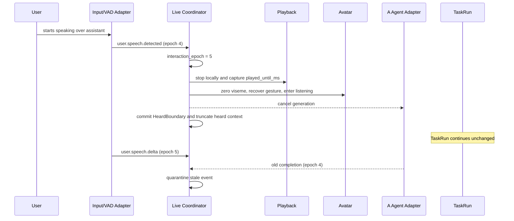

# Preacherman Live Interaction Contract v0.1

Status: **draft, executable contract baseline**  
Schema version: **`0.1`**  
Scope: supplier-neutral live interaction only

## 1. Product intent

Preacherman is a continuously present digital person, not a chatbot with animations attached. The live contract coordinates continuous microphone input, turn detection, streaming A Agent output, speech synthesis, actual audio playback, avatar performance, interruption, reconnect, and independent B Agent task progress.

This version deliberately does not connect a real Realtime, ASR, TTS, VAD, or avatar-motion provider. Provider adapters translate provider-native events into this contract; UI, Avatar, Memory, and Task code consume only Preacherman Live Events.

## 2. Non-negotiable invariants

1. `InteractionSession` survives connection replacement and spans multiple turns.
2. `LiveConnection` may be replaced without replacing the session, turn history, or active `TaskRun`.
3. `TurnRoutingSnapshot` is captured once at turn start and is immutable for that turn.
4. `InteractionGeneration` and `TaskRun` are independent lifecycle branches.
5. Normal voice interruption cancels the current generation, pending synthesis, local playback, and avatar performance; it does not cancel a task.
6. Generation-scoped events are accepted only for the active `generation_id` and `interaction_epoch`.
7. Task events are governed by `task_run_id`; a speech epoch change does not invalidate them.
8. The audio playback layer owns the only output clock. Captions, visemes, expression cues, and gestures do not create independent output timers.
9. Generated, synthesized, and actually played content remain separate records.
10. Only actually played content may enter `ConversationContextProjection` as content heard by the user.
11. Local audio and avatar output stop immediately on barge-in. Remote cancellation acknowledgement is not on the critical path.
12. Cancellation is always scoped; there is no unqualified `cancel` command.

## 3. Lifecycle model

```text
InteractionSession
├── LiveConnection (replaceable)
│   ├── InputAudioStream
│   ├── OutputAudioStream
│   └── PlaybackClock
└── Turn
    ├── InteractionGeneration
    │   ├── A Agent inference
    │   ├── Speech synthesis
    │   ├── Audio playback
    │   └── AvatarPerformance
    └── TaskRun
        ├── B Agent runtime
        ├── Tool calls
        └── Progress reporting
```

The session owns durable interaction history. A connection is transport state. A turn freezes routing decisions. A generation owns one candidate assistant response and its output performance. A task owns background work and can outlive the speech generation that created it.

### Lifecycle states

| Lifecycle | States |
|---|---|
| Interaction | `idle`, `listening`, `thinking`, `speaking`, `recovering`, `error` |
| Connection | `closed`, `opening`, `open`, `degraded`, `reconnecting`, `failed` |
| Generation | `requested`, `generating`, `synthesizing`, `playing`, `completed`, `interrupted`, `cancelled`, `failed` |
| Playback | `idle`, `queued`, `playing`, `interrupted`, `completed`, `cleared` |
| TaskRun | `running`, `awaiting_input`, `needs_approval`, `completed`, `failed`, `cancelled` |

## 4. Event envelope

Every event contains:

| Field | Requirement | Meaning |
|---|---|---|
| `event_id` | required | Global idempotency identity |
| `event_type` | required | Preacherman event name |
| `schema_version` | required | Exact live-contract schema version |
| `session_id` | required | Stable multi-turn session |
| `sequence` | required | Monotonic within `correlation_id` |
| `interaction_epoch` | required | Output-generation isolation epoch |
| `occurred_at` | required | Wall-clock audit timestamp |
| `monotonic_time_ms` | required | Monotonic ordering/latency timestamp |
| `correlation_id` | required | Ordered stream identity |
| `causation_event_id` | optional | Direct causal parent |
| `payload` | required | Event-specific, closed TypeScript payload |

Lifecycle identity fields are required by event family:

| Event family | Required identity fields |
|---|---|
| `live.connection.*` | `connection_id` |
| `user.*` | `connection_id`, `turn_id` |
| `assistant.*` | `turn_id`, `generation_id`, `response_id` |
| `speech.*` | `turn_id`, `generation_id`, `response_id`, `audio_stream_id` |
| `playback.*` | `turn_id`, `generation_id`, `response_id`, `audio_stream_id` |
| `avatar.*` | `turn_id`, `generation_id`, `response_id`, `audio_stream_id`, `performance_id` |
| `task.*` | `turn_id`, `task_run_id` |

The other lifecycle identity fields remain optional in the common envelope and may be populated only when they add a real causal link. For example, a task event can optionally reference the response that announced it, but it is never made generation-scoped by that diagnostic reference.

Provider request bodies, provider event names, concrete transport APIs, credentials, and long-lived browser secrets are not valid envelope fields or payload extensions. The connection-opening payload therefore uses the neutral transport capabilities `peer_media`, `bidirectional_stream`, or `mock`.

## 5. Event catalog

### User input

- `user.speech.detected`
- `user.speech.started`
- `user.speech.delta`
- `user.speech.stopped`
- `user.audio.committed`
- `user.transcript.partial`
- `user.transcript.final`

### A Agent generation

- `assistant.generation.requested`
- `assistant.generation.started`
- `assistant.text.delta`
- `assistant.segment.ready`
- `assistant.generation.completed`
- `assistant.generation.interrupted`
- `assistant.generation.cancelled`
- `assistant.generation.failed`

### Speech synthesis

- `speech.synthesis.started`
- `speech.audio.chunk`
- `speech.viseme.chunk`
- `speech.synthesis.completed`
- `speech.synthesis.cancelled`
- `speech.synthesis.failed`

### Audio playback

- `playback.queued`
- `playback.started`
- `playback.progress`
- `playback.completed`
- `playback.interrupted`
- `playback.cleared`

### Avatar performance

- `avatar.performance.requested`
- `avatar.performance.started`
- `avatar.performance.cue`
- `avatar.performance.transitioned`
- `avatar.performance.settled`
- `avatar.performance.interrupted`
- `avatar.performance.cancelled`

### B Agent task progress

- `task.started`
- `task.progress`
- `task.awaiting_input`
- `task.needs_approval`
- `task.completed`
- `task.failed`
- `task.cancelled`

### Connection lifecycle

- `live.connection.opening`
- `live.connection.opened`
- `live.connection.degraded`
- `live.connection.reconnecting`
- `live.connection.restored`
- `live.connection.closed`
- `live.connection.failed`

## 6. Turn routing freeze

`assistant.generation.requested` carries a `TurnRoutingSnapshot` containing the selected front-agent adapter, speech adapter, voice, locale, live contract version, and avatar policy version. The first snapshot recorded for a `turn_id` is authoritative. Retries and generations inside that turn reuse it. Provider failover that changes routing starts a new turn or follows a future explicit routing-migration contract; it must not silently mutate the snapshot.

## 7. Cancellation propagation matrix

| Command | Input for current turn | A generation | TTS | Playback | Avatar performance | TaskRun | Connection | Session |
|---|---:|---:|---:|---:|---:|---:|---:|---:|
| `interrupt_speech` | continues with new speech | stop | stop pending | stop locally now | interrupt/recover | **continue** | continue | continue |
| `cancel_interaction_generation` | unchanged | cancel | cancel | clear | cancel | **continue** | continue | continue |
| `cancel_current_turn` | cancel current input | cancel | cancel | clear | cancel | **continue** | continue | continue |
| `cancel_task_run` | unchanged | continue | continue | continue | continue | cancel requested task | continue | continue |
| `end_session` | stop | cancel | cancel | clear | cancel | cancel active tasks | close | end |

`cancel_current_turn` does not imply `cancel_task_run`. A task can remain visible as a background task after the conversational turn is cancelled. Product policy may later offer a compound command, but it must remain an explicit composition of scoped commands.

## 8. Heard Boundary and context projection

Four records must remain distinct:

| Record | Contains |
|---|---|
| `GeneratedResponseRecord` | Complete text generated by A, including interrupted audit text |
| `SynthesizedSpeechRecord` | Audio segments actually synthesized |
| `PlaybackLedger` | Sample-clock progress and aligned heard text actually sent to the output device |
| `ConversationContextProjection` | User-visible conversational history derived only from the playback ledger |

`HeardBoundary` contains:

- `response_id`
- `audio_stream_id`
- `played_until_ms`
- `committed_segment_ids`
- `partial_segment_id`
- `interrupted`

`playback.progress` is the sole event allowed to append assistant text to the heard conversation projection. `assistant.text.delta`, `assistant.segment.ready`, and `speech.audio.chunk` are never sufficient evidence that the user heard content.

If alignment cannot prove which words in a partial segment were played, the projection remains conservative: it commits the aligned `heard_text_delta` and complete segment identities supplied by the playback layer, and does not infer the remainder from generated text.

## 9. PlaybackClock

The output audio layer owns `PlaybackClock` and exposes:

- `current_time_ms`
- `played_samples`
- `buffered_until_ms`
- `output_latency_ms`
- `playback_state`
- `audio_stream_id`
- `clock_epoch`

Captions, visemes, expressions, gaze, and gesture cues subscribe to this clock. They may interpolate values on render frames, but they may not build authoritative timelines with `setTimeout` or independent clocks. `clock_epoch` invalidates callbacks captured from an earlier playback instance.

## 10. AvatarPerformanceDirector input

A supplies semantic performance intent, never a GLB clip or action filename.

Response-level plan:

- `baseline_emotion`
- `energy` (`0..1`)
- `gaze_policy`
- `gesture_density`
- `speaking_style`

Segment-level cue:

- `segment_id`
- `intent`
- `emphasis` (`0..1`)
- `emotion_shift`
- `gaze_target`
- `gesture_intent`
- `start_anchor`

`AvatarPerformanceDirector` will later map these semantic values to the Cortana action library. That retrieval and transition algorithm is outside v0.1.

## 11. Interruption transaction

`user.speech.detected` with `barged_in: true` starts a synchronous local transaction:

1. Accept `user.speech.detected` in the current epoch.
2. Increment `interaction_epoch`.
3. Stop local audio immediately.
4. Capture `played_until_ms` from `PlaybackClock`.
5. Zero the active viseme output.
6. Put the active gesture into fast recovery.
7. Cancel unplayed speech synthesis.
8. Cancel the active A generation.
9. Write the interrupted `HeardBoundary`.
10. Freeze `ConversationContextProjection` at actually played text.
11. Quarantine events from the old generation or epoch.
12. Put Avatar into listening performance.
13. Continue the new user audio through the input pipeline.

Remote acknowledgement may arrive later and is audit information only. It does not delay steps 3–6.



## 12. Ordering, gaps, idempotency, and late events

Ordering is scoped by `correlation_id`, not by one global sequence shared by independent producers.

Recommended correlation streams:

- `connection:{connection_id}`
- `input:{turn_id}`
- `generation:{generation_id}`
- `task:{task_run_id}`

Policy:

1. A repeated `event_id` returns `duplicate` and has no second effect.
2. The next expected sequence is applied immediately.
3. A future sequence is buffered until the gap arrives.
4. Buffered events drain in sequence order.
5. Reuse of an already applied sequence by a different event is quarantined as `sequence_conflict`.
6. A generation-scoped event with an old epoch is quarantined as `stale_epoch`.
7. An event for a cancelled or replaced generation is quarantined as `stale_generation`.
8. Task events are not discarded merely because the speech epoch advanced; task ordering uses `task_run_id` and its correlation stream.

A production coordinator must persist or bound buffers and define a gap timeout. v0.1 defines the deterministic disposition but does not choose persistence limits or timeout duration.

## 13. Example event sequence

```json
[
  {
    "event_id": "evt-1",
    "event_type": "user.speech.started",
    "schema_version": "0.1",
    "session_id": "session-1",
    "connection_id": "connection-1",
    "turn_id": "turn-4",
    "sequence": 1,
    "interaction_epoch": 7,
    "occurred_at": "2026-08-02T10:00:00.000Z",
    "monotonic_time_ms": 1200,
    "correlation_id": "input:turn-4",
    "payload": { "input_audio_stream_id": "input-audio-4" }
  },
  {
    "event_id": "evt-2",
    "event_type": "assistant.generation.requested",
    "schema_version": "0.1",
    "session_id": "session-1",
    "turn_id": "turn-4",
    "generation_id": "generation-4",
    "response_id": "response-4",
    "sequence": 1,
    "interaction_epoch": 7,
    "occurred_at": "2026-08-02T10:00:01.000Z",
    "monotonic_time_ms": 2200,
    "correlation_id": "generation:generation-4",
    "payload": {
      "routing_snapshot": {
        "snapshot_id": "routing-4",
        "captured_at": "2026-08-02T10:00:01.000Z",
        "front_agent_adapter_id": "front-adapter-a",
        "speech_adapter_id": "speech-adapter-a",
        "voice_ref": "voice-primary",
        "locale": "zh-CN",
        "live_contract_version": "0.1",
        "avatar_policy_version": "avatar-policy-1"
      }
    }
  }
]
```

## 14. Schema and versioning policy

- `0.1` is a draft schema and is not wire-compatible with the frozen AB Protocol version number.
- Event types and payloads form a closed TypeScript map. Core consumers must not switch on provider event names.
- Adding a new optional payload field or a new event type is a draft-compatible extension only when existing consumers ignore unknown event types safely through adapter capability negotiation.
- Renaming an event, changing identity requirements, changing field meaning, or making an optional field required needs a new live schema version.
- Adapters declare the exact versions they can emit. A coordinator rejects unsupported versions before applying lifecycle effects.
- Persisted events retain their original `schema_version`; migrations create a new projection and do not rewrite audit history in place.

## 15. v0.1 implementation boundary

Implemented in this baseline:

- supplier-neutral TypeScript envelope and payload map;
- lifecycle, scoped cancellation, Heard Boundary, playback ledger, context projection, performance-plan, and clock types;
- deterministic event simulator;
- local interruption transaction;
- generation/epoch late-event quarantine;
- task independence, explicit task cancellation, reconnect preservation, idempotency, and sequence buffering tests.

Not implemented:

- real provider adapters or credentials;
- production persistence, queueing, buffer limits, or gap timeouts;
- microphone, ASR, VAD, TTS, WebRTC, or WebSocket transport;
- 412-action semantic retrieval and animation blending;
- facial Shape Keys or viseme rendering;
- production playback device or audio clock;
- integration into React UI, Memory, ABOrchestrator, or existing Agent Runtime.
